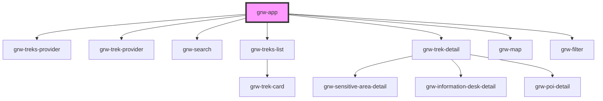

# grw-app

<!-- Auto Generated Below -->

## Properties

| Property                    | Attribute                      | Description | Type      | Default     |
| --------------------------- | ------------------------------ | ----------- | --------- | ----------- |
| `api`                       | `api`                          |             | `string`  | `undefined` |
| `appHeight`                 | `app-height`                   |             | `string`  | `'100vh'`   |
| `appWidth`                  | `app-width`                    |             | `string`  | `'100%'`    |
| `attribution`               | `attribution`                  |             | `string`  | `undefined` |
| `center`                    | `center`                       |             | `string`  | `undefined` |
| `cities`                    | `cities`                       |             | `string`  | `undefined` |
| `colorBackground`           | `color-background`             |             | `string`  | `'#fef7ff'` |
| `colorOnPrimary`            | `color-on-primary`             |             | `string`  | `'#ffffff'` |
| `colorOnPrimaryContainer`   | `color-on-primary-container`   |             | `string`  | `'#21005e'` |
| `colorOnSecondaryContainer` | `color-on-secondary-container` |             | `string`  | `'#1d192b'` |
| `colorOnSurface`            | `color-on-surface`             |             | `string`  | `'#49454e'` |
| `colorOnSurfaceVariant`     | `color-on-surface-variant`     |             | `string`  | `'#1c1b1f'` |
| `colorPoiIcon`              | `color-poi-icon`               |             | `string`  | `'#974c6e'` |
| `colorPrimaryApp`           | `color-primary-app`            |             | `string`  | `'#6750a4'` |
| `colorPrimaryContainer`     | `color-primary-container`      |             | `string`  | `'#eaddff'` |
| `colorSecondaryContainer`   | `color-secondary-container`    |             | `string`  | `'#e8def8'` |
| `colorSensitiveArea`        | `color-sensitive-area`         |             | `string`  | `'#4974a5'` |
| `colorSurface`              | `color-surface`                |             | `string`  | `'#1c1b1f'` |
| `colorSurfaceContainerHigh` | `color-surface-container-high` |             | `string`  | `'#ece6f0'` |
| `colorSurfaceContainerLow`  | `color-surface-container-low`  |             | `string`  | `'#f7f2fa'` |
| `colorSurfaceVariant`       | `color-surface-variant`        |             | `string`  | `'#fef7ff'` |
| `colorTrekLine`             | `color-trek-line`              |             | `string`  | `'#6b0030'` |
| `districts`                 | `districts`                    |             | `string`  | `undefined` |
| `fabBackgroundColor`        | `fab-background-color`         |             | `string`  | `'#eaddff'` |
| `fabColor`                  | `fab-color`                    |             | `string`  | `'#21005d'` |
| `inBbox`                    | `in-bbox`                      |             | `string`  | `undefined` |
| `languages`                 | `languages`                    |             | `string`  | `'fr'`      |
| `portals`                   | `portals`                      |             | `string`  | `undefined` |
| `practices`                 | `practices`                    |             | `string`  | `undefined` |
| `routes`                    | `routes`                       |             | `string`  | `undefined` |
| `structures`                | `structures`                   |             | `string`  | `undefined` |
| `themes`                    | `themes`                       |             | `string`  | `undefined` |
| `urlLayer`                  | `url-layer`                    |             | `string`  | `undefined` |
| `useGradient`               | `use-gradient`                 |             | `boolean` | `false`     |
| `weather`                   | `weather`                      |             | `boolean` | `false`     |
| `zoom`                      | `zoom`                         |             | `number`  | `undefined` |

## Events

| Event         | Description | Type               |
| ------------- | ----------- | ------------------ |
| `resetFilter` |             | `CustomEvent<any>` |

## Dependencies

### Depends on

- [grw-treks-provider](../../store)
- [grw-trek-provider](../../store)
- [grw-search](../grw-search)
- [grw-treks-list](../grw-treks-list)
- [grw-trek-detail](../grw-trek-detail)
- [grw-map](../grw-map)
- [grw-filter](../grw-filter)

### Graph

----------------------------------------------

*Built with [StencilJS](https://stenciljs.com/)*
