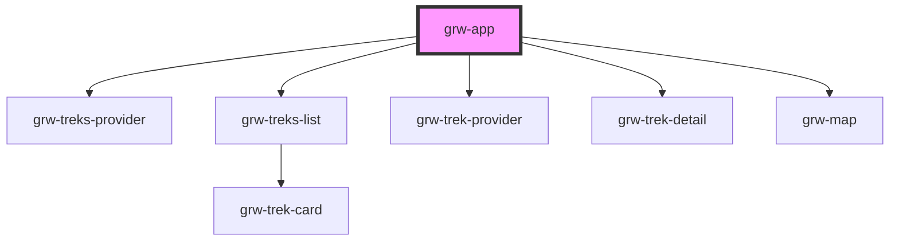

# grw-app

<!-- Auto Generated Below -->

## Properties

| Property  | Attribute  | Description | Type     | Default                  |
| --------- | ---------- | ----------- | -------- | ------------------------ |
| `api`     | `api`      |             | `string` | `undefined`              |
| `appName` | `app-name` |             | `string` | `'Geotrek Rando Widget'` |
| `portals` | `portals`  |             | `string` | `undefined`              |

## Dependencies

### Depends on

- [grw-treks-provider](../../store)
- [grw-treks-list](../grw-treks-list)
- [grw-trek-provider](../../store)
- [grw-trek-detail](../grw-trek-detail)
- [grw-map](../grw-map)

### Graph

----------------------------------------------

*Built with [StencilJS](https://stenciljs.com/)*
