# grw-app

<!-- Auto Generated Below -->

## Properties

| Property                     | Attribute                       | Description | Type      | Default     |
| ---------------------------- | ------------------------------- | ----------- | --------- | ----------- |
| `api`                        | `api`                           |             | `string`  | `undefined` |
| `appHeight`                  | `app-height`                    |             | `string`  | `'100vh'`   |
| `appWidth`                   | `app-width`                     |             | `string`  | `'100%'`    |
| `attributionLayer`           | `attribution-layer`             |             | `string`  | `undefined` |
| `cities`                     | `cities`                        |             | `string`  | `undefined` |
| `colorBackground`            | `color-background`              |             | `string`  | `'#fef7ff'` |
| `colorClusters`              | `color-clusters`                |             | `any`     | `null`      |
| `colorMarkers`               | `color-markers`                 |             | `any`     | `null`      |
| `colorOnPrimary`             | `color-on-primary`              |             | `string`  | `'#ffffff'` |
| `colorOnPrimaryContainer`    | `color-on-primary-container`    |             | `string`  | `'#21005e'` |
| `colorOnSecondaryContainer`  | `color-on-secondary-container`  |             | `string`  | `'#1d192b'` |
| `colorOnSurface`             | `color-on-surface`              |             | `string`  | `'#49454e'` |
| `colorOnSurfaceVariant`      | `color-on-surface-variant`      |             | `string`  | `'#1c1b1f'` |
| `colorOutdoorArea`           | `color-outdoor-area`            |             | `string`  | `'#ffb700'` |
| `colorPrimary`               | `color-primary`                 |             | `string`  | `'#6750a4'` |
| `colorPrimaryApp`            | `color-primary-app`             |             | `string`  | `'#6750a4'` |
| `colorPrimaryContainer`      | `color-primary-container`       |             | `string`  | `'#eaddff'` |
| `colorSecondaryContainer`    | `color-secondary-container`     |             | `string`  | `'#e8def8'` |
| `colorSensitiveArea`         | `color-sensitive-area`          |             | `string`  | `'#4974a5'` |
| `colorSurface`               | `color-surface`                 |             | `string`  | `'#1c1b1f'` |
| `colorSurfaceContainerHigh`  | `color-surface-container-high`  |             | `string`  | `'#ece6f0'` |
| `colorSurfaceContainerLow`   | `color-surface-container-low`   |             | `string`  | `'#f7f2fa'` |
| `colorSurfaceVariant`        | `color-surface-variant`         |             | `string`  | `'#fef7ff'` |
| `colorTrekLine`              | `color-trek-line`               |             | `string`  | `'#6b0030'` |
| `commonMarkerSize`           | `common-marker-size`            |             | `number`  | `48`        |
| `departureArrivalMarkerSize` | `departure-arrival-marker-size` |             | `number`  | `14`        |
| `districts`                  | `districts`                     |             | `string`  | `undefined` |
| `emergencyNumber`            | `emergency-number`              |             | `number`  | `undefined` |
| `enableOffline`              | `enable-offline`                |             | `boolean` | `false`     |
| `fabBackgroundColor`         | `fab-background-color`          |             | `string`  | `'#eaddff'` |
| `fabColor`                   | `fab-color`                     |             | `string`  | `'#21005d'` |
| `fontFamily`                 | `font-family`                   |             | `string`  | `'Roboto'`  |
| `globalTilesMaxZoomOffline`  | `global-tiles-max-zoom-offline` |             | `number`  | `11`        |
| `globalTilesMinZoomOffline`  | `global-tiles-min-zoom-offline` |             | `number`  | `0`         |
| `inBbox`                     | `in-bbox`                       |             | `string`  | `undefined` |
| `labels`                     | `labels`                        |             | `string`  | `undefined` |
| `languages`                  | `languages`                     |             | `string`  | `'fr'`      |
| `largeViewSize`              | `large-view-size`               |             | `number`  | `1024`      |
| `mainClusterSize`            | `main-cluster-size`             |             | `number`  | `48`        |
| `mainMarkerSize`             | `main-marker-size`              |             | `number`  | `32`        |
| `nameLayer`                  | `name-layer`                    |             | `string`  | `undefined` |
| `outdoor`                    | `outdoor`                       |             | `boolean` | `false`     |
| `pointReferenceMarkerSize`   | `point-reference-marker-size`   |             | `number`  | `24`        |
| `portals`                    | `portals`                       |             | `string`  | `undefined` |
| `practices`                  | `practices`                     |             | `string`  | `undefined` |
| `rounded`                    | `rounded`                       |             | `boolean` | `true`      |
| `routes`                     | `routes`                        |             | `string`  | `undefined` |
| `selectedMainMarkerSize`     | `selected-main-marker-size`     |             | `number`  | `48`        |
| `structures`                 | `structures`                    |             | `string`  | `undefined` |
| `themes`                     | `themes`                        |             | `string`  | `undefined` |
| `tilesMaxZoomOffline`        | `tiles-max-zoom-offline`        |             | `number`  | `16`        |
| `tilesMinZoomOffline`        | `tiles-min-zoom-offline`        |             | `number`  | `12`        |
| `touristicContents`          | `touristic-contents`            |             | `boolean` | `false`     |
| `touristicEvents`            | `touristic-events`              |             | `boolean` | `false`     |
| `treks`                      | `treks`                         |             | `boolean` | `true`      |
| `urlLayer`                   | `url-layer`                     |             | `string`  | `undefined` |
| `useGradient`                | `use-gradient`                  |             | `boolean` | `false`     |
| `weather`                    | `weather`                       |             | `boolean` | `false`     |

## Shadow Parts

| Part                      | Description |
| ------------------------- | ----------- |
| `"grw-offline-container"` |             |
| `"icon"`                  |             |

## Dependencies

### Depends on

- [grw-loader](../grw-loader)
- [grw-treks-provider](../../store)
- [grw-trek-provider](../../store)
- [grw-touristic-content-provider](../../store)
- [grw-touristic-event-provider](../../store)
- [grw-outdoor-site-provider](../../store)
- [grw-outdoor-course-provider](../../store)
- [grw-touristic-contents-provider](../../store)
- [grw-touristic-events-provider](../../store)
- [grw-outdoor-sites-provider](../../store)
- [grw-select-language](../grw-select-language)
- [grw-segmented-segment](../grw-segmented-segment)
- [grw-search](../grw-search)
- [grw-common-button](../grw-common-button)
- [grw-switch](../grw-switch)
- [grw-treks-list](../grw-treks-list)
- [grw-touristic-contents-list](../grw-touristic-contents-list)
- [grw-touristic-events-list](../grw-touristic-events-list)
- [grw-outdoor-sites-list](../grw-outdoor-sites-list)
- [grw-trek-detail](../grw-trek-detail)
- [grw-offline-confirm-modal](../grw-offline-confirm-modal)
- [grw-touristic-content-detail](../grw-touristic-content-detail)
- [grw-touristic-event-detail](../grw-touristic-event-detail)
- [grw-outdoor-site-detail](../grw-outdoor-site-detail)
- [grw-outdoor-course-detail](../grw-outdoor-course-detail)
- [grw-map](../grw-map)
- [grw-extended-fab](../grw-extended-fab)
- [grw-filters](../grw-filters)

### Graph

```mermaid
graph TD;
  grw-app --> grw-loader
  grw-app --> grw-treks-provider
  grw-app --> grw-trek-provider
  grw-app --> grw-touristic-content-provider
  grw-app --> grw-touristic-event-provider
  grw-app --> grw-outdoor-site-provider
  grw-app --> grw-outdoor-course-provider
  grw-app --> grw-touristic-contents-provider
  grw-app --> grw-touristic-events-provider
  grw-app --> grw-outdoor-sites-provider
  grw-app --> grw-select-language
  grw-app --> grw-segmented-segment
  grw-app --> grw-search
  grw-app --> grw-common-button
  grw-app --> grw-switch
  grw-app --> grw-treks-list
  grw-app --> grw-touristic-contents-list
  grw-app --> grw-touristic-events-list
  grw-app --> grw-outdoor-sites-list
  grw-app --> grw-trek-detail
  grw-app --> grw-offline-confirm-modal
  grw-app --> grw-touristic-content-detail
  grw-app --> grw-touristic-event-detail
  grw-app --> grw-outdoor-site-detail
  grw-app --> grw-outdoor-course-detail
  grw-app --> grw-map
  grw-app --> grw-extended-fab
  grw-app --> grw-filters
  grw-treks-list --> grw-trek-card
  grw-touristic-contents-list --> grw-touristic-content-card
  grw-touristic-events-list --> grw-touristic-event-card
  grw-outdoor-sites-list --> grw-outdoor-site-card
  grw-trek-detail --> grw-trek-card
  grw-trek-detail --> grw-poi
  grw-trek-detail --> grw-sensitive-area-detail
  grw-trek-detail --> grw-information-desk
  grw-trek-detail --> grw-touristic-content-card
  grw-trek-detail --> grw-touristic-event-card
  grw-outdoor-site-detail --> grw-poi
  grw-outdoor-site-detail --> grw-outdoor-site-card
  grw-outdoor-site-detail --> grw-outdoor-course-card
  grw-outdoor-site-detail --> grw-information-desk
  grw-outdoor-site-detail --> grw-touristic-content-card
  grw-outdoor-site-detail --> grw-touristic-event-card
  grw-outdoor-course-detail --> grw-touristic-content-card
  grw-outdoor-course-detail --> grw-touristic-event-card
  grw-outdoor-course-detail --> grw-poi
  grw-filters --> grw-filter
  style grw-app fill:#f9f,stroke:#333,stroke-width:4px
```

----------------------------------------------

*Built with [StencilJS](https://stenciljs.com/)*
