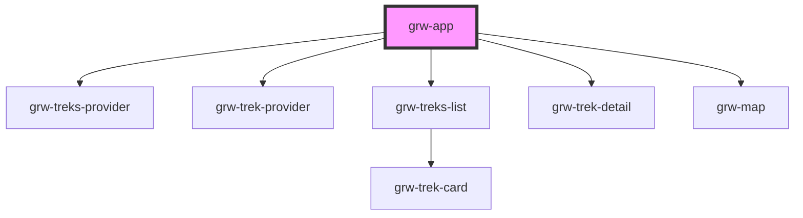

# grw-app

<!-- Auto Generated Below -->

## Properties

| Property              | Attribute               | Description | Type     | Default                  |
| --------------------- | ----------------------- | ----------- | -------- | ------------------------ |
| `api`                 | `api`                   |             | `string` | `undefined`              |
| `appName`             | `app-name`              |             | `string` | `'Geotrek Rando Widget'` |
| `attribution`         | `attribution`           |             | `string` | `undefined`              |
| `center`              | `center`                |             | `string` | `undefined`              |
| `cities`              | `cities`                |             | `string` | `undefined`              |
| `colorArrivalIcon`    | `color-arrival-icon`    |             | `string` | `'#85003b'`              |
| `colorDepartureIcon`  | `color-departure-icon`  |             | `string` | `'#006b3b'`              |
| `colorPrimary`        | `color-primary`         |             | `string` | `'#6b0030'`              |
| `colorPrimaryShade`   | `color-primary-shade`   |             | `string` | `'#4a0021'`              |
| `colorPrimaryTint`    | `color-primary-tint`    |             | `string` | `'#974c6e'`              |
| `colorTrekLine`       | `color-trek-line`       |             | `string` | `'#6b0030'`              |
| `districts`           | `districts`             |             | `string` | `undefined`              |
| `inBbox`              | `in-bbox`               |             | `string` | `undefined`              |
| `language`            | `language`              |             | `string` | `'fr'`                   |
| `portals`             | `portals`               |             | `string` | `undefined`              |
| `practices`           | `practices`             |             | `string` | `undefined`              |
| `routes`              | `routes`                |             | `string` | `undefined`              |
| `sensitiveAreasColor` | `sensitive-areas-color` |             | `string` | `'#4974a5'`              |
| `structures`          | `structures`            |             | `string` | `undefined`              |
| `themes`              | `themes`                |             | `string` | `undefined`              |
| `urlLayer`            | `url-layer`             |             | `string` | `undefined`              |
| `zoom`                | `zoom`                  |             | `any`    | `undefined`              |

## Dependencies

### Depends on

- [grw-treks-provider](../../store)
- [grw-trek-provider](../../store)
- [grw-treks-list](../grw-treks-list)
- [grw-trek-detail](../grw-trek-detail)
- [grw-map](../grw-map)

### Graph

----------------------------------------------

*Built with [StencilJS](https://stenciljs.com/)*
