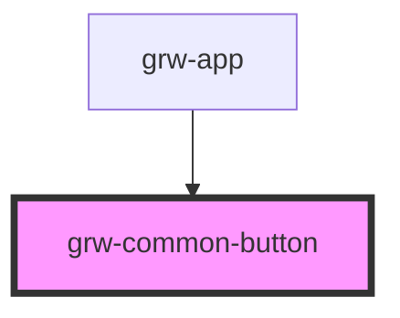

# grw-common-button

<!-- Auto Generated Below -->

## Properties

| Property     | Attribute     | Description | Type       | Default     |
| ------------ | ------------- | ----------- | ---------- | ----------- |
| `action`     | --            |             | `Function` | `undefined` |
| `fontFamily` | `font-family` |             | `string`   | `'Roboto'`  |
| `icon`       | `icon`        |             | `string`   | `undefined` |
| `name`       | `name`        |             | `string`   | `undefined` |

## Dependencies

### Used by

 - [grw-app](../grw-app)

### Graph

----------------------------------------------

*Built with [StencilJS](https://stenciljs.com/)*
