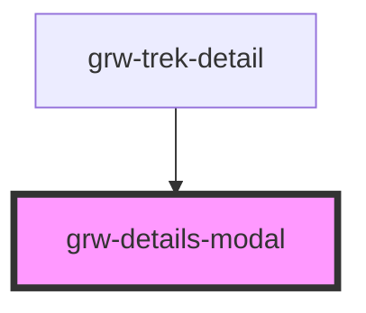

# grw-details-modal

<!-- Auto Generated Below -->

## Events

| Event               | Description | Type                  |
| ------------------- | ----------- | --------------------- |
| `closeDetailsModal` |             | `CustomEvent<number>` |

## Shadow Parts

| Part     | Description |
| -------- | ----------- |
| `"icon"` |             |

## Dependencies

### Used by

 - [grw-trek-detail](../grw-trek-detail)

### Graph

----------------------------------------------

*Built with [StencilJS](https://stenciljs.com/)*
