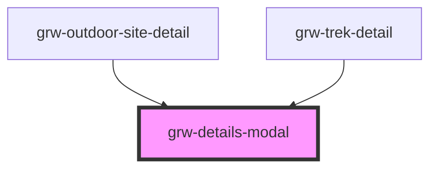

# grw-details-modal

<!-- Auto Generated Below -->

## Properties

| Property                  | Attribute                    | Description | Type      | Default     |
| ------------------------- | ---------------------------- | ----------- | --------- | ----------- |
| `colorBackground`         | `color-background`           |             | `string`  | `'#fef7ff'` |
| `colorOnPrimaryContainer` | `color-on-primary-container` |             | `string`  | `'#49454e'` |
| `colorPrimaryContainer`   | `color-primary-container`    |             | `string`  | `'#eaddff'` |
| `fontFamily`              | `font-family`                |             | `string`  | `'Roboto'`  |
| `rounded`                 | `rounded`                    |             | `boolean` | `true`      |

## Events

| Event               | Description | Type                  |
| ------------------- | ----------- | --------------------- |
| `closeDetailsModal` |             | `CustomEvent<number>` |

## Shadow Parts

| Part                     | Description |
| ------------------------ | ----------- |
| `"arrow-back-container"` |             |
| `"arrow-back-icon"`      |             |
| `"content-modal"`        |             |
| `"details-modal"`        |             |
| `"icon"`                 |             |
| `"modal-container"`      |             |

## Dependencies

### Used by

 - [grw-outdoor-site-detail](../grw-outdoor-site-detail)
 - [grw-trek-detail](../grw-trek-detail)

### Graph

----------------------------------------------

*Built with [StencilJS](https://stenciljs.com/)*
