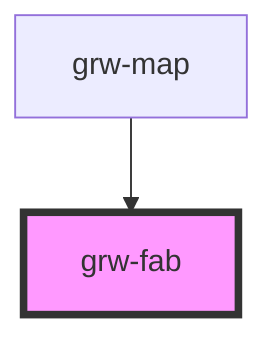

# grw-fab

<!-- Auto Generated Below -->

## Properties

| Property             | Attribute              | Description | Type       | Default     |
| -------------------- | ---------------------- | ----------- | ---------- | ----------- |
| `action`             | --                     |             | `Function` | `undefined` |
| `fabBackgroundColor` | `fab-background-color` |             | `string`   | `'#eaddff'` |
| `fabColor`           | `fab-color`            |             | `string`   | `'#21005d'` |
| `fontFamily`         | `font-family`          |             | `string`   | `'Roboto'`  |
| `hideTitle`          | `hide-title`           |             | `string`   | `undefined` |
| `icon`               | --                     |             | `Function` | `undefined` |
| `showTitle`          | `show-title`           |             | `string`   | `undefined` |

## Shadow Parts

| Part                           | Description |
| ------------------------------ | ----------- |
| `"fab-visibility-button"`      |             |
| `"fab-visibility-button-icon"` |             |

## Dependencies

### Used by

 - [grw-map](../grw-map)

### Graph

----------------------------------------------

*Built with [StencilJS](https://stenciljs.com/)*
