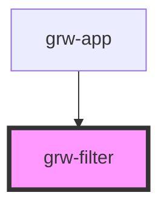

# grw-filter

<!-- Auto Generated Below -->

## Properties

| Property             | Attribute              | Description | Type     | Default     |
| -------------------- | ---------------------- | ----------- | -------- | ----------- |
| `filterName`         | `filter-name`          |             | `string` | `undefined` |
| `filterNameProperty` | `filter-name-property` |             | `string` | `undefined` |
| `filterType`         | `filter-type`          |             | `string` | `undefined` |

## Dependencies

### Used by

 - [grw-app](../grw-app)

### Graph

----------------------------------------------

*Built with [StencilJS](https://stenciljs.com/)*
