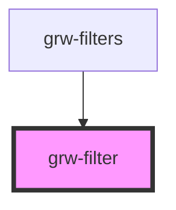

# grw-filter

<!-- Auto Generated Below -->

## Properties

| Property             | Attribute              | Description | Type     | Default     |
| -------------------- | ---------------------- | ----------- | -------- | ----------- |
| `filterName`         | `filter-name`          |             | `string` | `undefined` |
| `filterNameProperty` | `filter-name-property` |             | `string` | `undefined` |
| `filterPlaceholder`  | `filter-placeholder`   |             | `string` | `''`        |
| `filterType`         | `filter-type`          |             | `string` | `undefined` |
| `fontFamily`         | `font-family`          |             | `string` | `'Roboto'`  |
| `segment`            | `segment`              |             | `string` | `undefined` |

## Shadow Parts

| Part                        | Description |
| --------------------------- | ----------- |
| `"filter-button"`           |             |
| `"filter-button-container"` |             |
| `"filter-label"`            |             |
| `"filter-name"`             |             |
| `"filter-select"`           |             |
| `"selected-filter-icon"`    |             |

## Dependencies

### Used by

 - [grw-filters](../grw-filters)

### Graph

----------------------------------------------

*Built with [StencilJS](https://stenciljs.com/)*
