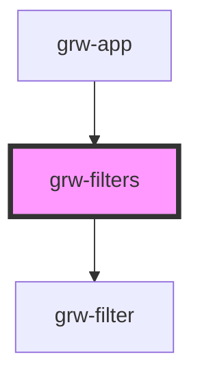

# grw-filters

<!-- Auto Generated Below -->

## Properties

| Property        | Attribute     | Description | Type       | Default     |
| --------------- | ------------- | ----------- | ---------- | ----------- |
| `fontFamily`    | `font-family` |             | `string`   | `'Roboto'`  |
| `handleFilters` | --            |             | `Function` | `undefined` |

## Events

| Event         | Description | Type               |
| ------------- | ----------- | ------------------ |
| `resetFilter` |             | `CustomEvent<any>` |

## Shadow Parts

| Part                                     | Description |
| ---------------------------------------- | ----------- |
| `"back-filters-container"`               |             |
| `"current-treks-within-bounds-length"`   |             |
| `"filter-container"`                     |             |
| `"filter-option-button"`                 |             |
| `"filters-container"`                    |             |
| `"filters-options-buttons-container"`    |             |
| `"filters-options-container"`            |             |
| `"filters-segment-container"`            |             |
| `"filters-touristic-contents-container"` |             |
| `"filters-touristic-events-container"`   |             |
| `"filters-treks-container"`              |             |
| `"options-container"`                    |             |
| `"segment"`                              |             |
| `"segment-container"`                    |             |
| `"segmented-buttons-container"`          |             |

## Dependencies

### Used by

 - [grw-app](../grw-app)

### Depends on

- [grw-filter](../grw-filter)

### Graph

----------------------------------------------

*Built with [StencilJS](https://stenciljs.com/)*
