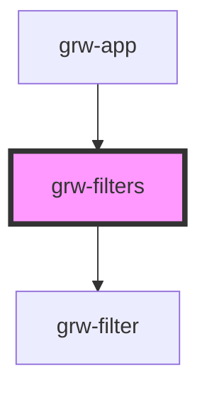

# grw-filters

<!-- Auto Generated Below -->

## Properties

| Property        | Attribute | Description | Type       | Default     |
| --------------- | --------- | ----------- | ---------- | ----------- |
| `handleFilters` | --        |             | `Function` | `undefined` |

## Events

| Event         | Description | Type               |
| ------------- | ----------- | ------------------ |
| `resetFilter` |             | `CustomEvent<any>` |

## Dependencies

### Used by

 - [grw-app](../grw-app)

### Depends on

- [grw-filter](../grw-filter)

### Graph

----------------------------------------------

*Built with [StencilJS](https://stenciljs.com/)*
