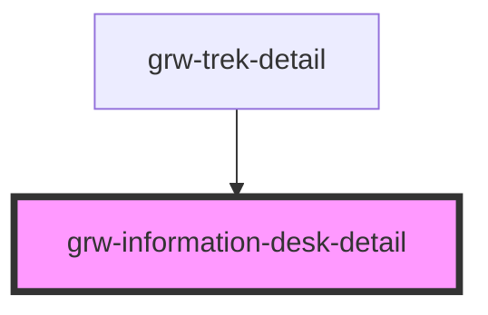

# grw-information-desk-detail

<!-- Auto Generated Below -->

## Properties

| Property          | Attribute | Description | Type                                                                                                                                                                                                                                              | Default     |
| ----------------- | --------- | ----------- | ------------------------------------------------------------------------------------------------------------------------------------------------------------------------------------------------------------------------------------------------- | ----------- |
| `informationDesk` | --        |             | `{ id: number; name: string; description: string; type: InformationDeskType; phone: string; email: string; website: string; municipality: string; postal_code: string; street: string; photo_url: string; latitude: number; longitude: number; }` | `undefined` |

## Events

| Event         | Description | Type                                                    |
| ------------- | ----------- | ------------------------------------------------------- |
| `centerOnMap` |             | `CustomEvent<{ latitude: number; longitude: number; }>` |

## Dependencies

### Used by

 - [grw-trek-detail](../grw-trek-detail)

### Graph

----------------------------------------------

*Built with [StencilJS](https://stenciljs.com/)*
