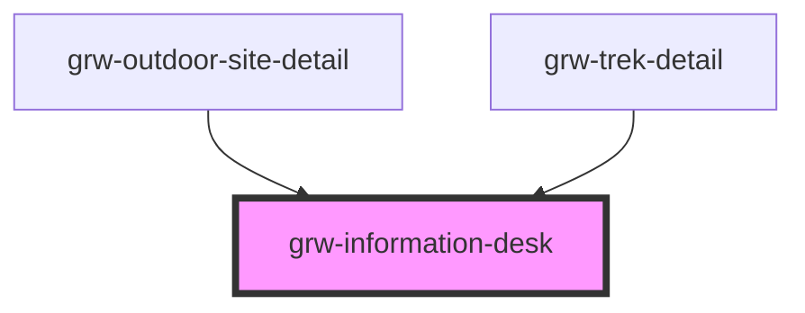

# grw-information-desk

<!-- Auto Generated Below -->

## Properties

| Property                   | Attribute                     | Description | Type                                                                                                                                                                                                                                              | Default     |
| -------------------------- | ----------------------------- | ----------- | ------------------------------------------------------------------------------------------------------------------------------------------------------------------------------------------------------------------------------------------------- | ----------- |
| `colorSurfaceContainerLow` | `color-surface-container-low` |             | `string`                                                                                                                                                                                                                                          | `'#f7f2fa'` |
| `informationDesk`          | --                            |             | `{ id: number; name: string; description: string; type: InformationDeskType; phone: string; email: string; website: string; municipality: string; postal_code: string; street: string; photo_url: string; latitude: number; longitude: number; }` | `undefined` |

## Events

| Event         | Description | Type                                                    |
| ------------- | ----------- | ------------------------------------------------------- |
| `centerOnMap` |             | `CustomEvent<{ latitude: number; longitude: number; }>` |

## Shadow Parts

| Part                                       | Description |
| ------------------------------------------ | ----------- |
| `"center-on-map-button"`                   |             |
| `"handle-information-desk-description"`    |             |
| `"icon"`                                   |             |
| `"information-desk-description"`           |             |
| `"information-desk-description-container"` |             |
| `"information-desk-img"`                   |             |
| `"information-desk-img-container"`         |             |
| `"information-desk-informations"`          |             |
| `"information-desk-name"`                  |             |
| `"information-desk-sub-container"`         |             |
| `"label"`                                  |             |
| `"link-container"`                         |             |
| `"mail-container"`                         |             |

## Dependencies

### Used by

 - [grw-outdoor-site-detail](../grw-outdoor-site-detail)
 - [grw-trek-detail](../grw-trek-detail)

### Graph

----------------------------------------------

*Built with [StencilJS](https://stenciljs.com/)*
