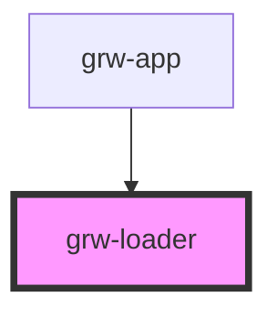

# grw-loader

<!-- Auto Generated Below -->

## Properties

| Property                  | Attribute                    | Description | Type     | Default     |
| ------------------------- | ---------------------------- | ----------- | -------- | ----------- |
| `colorOnPrimaryContainer` | `color-on-primary-container` |             | `string` | `'#21005e'` |
| `colorPrimaryContainer`   | `color-primary-container`    |             | `string` | `'#eaddff'` |

## Dependencies

### Used by

 - [grw-app](../grw-app)

### Graph

----------------------------------------------

*Built with [StencilJS](https://stenciljs.com/)*
