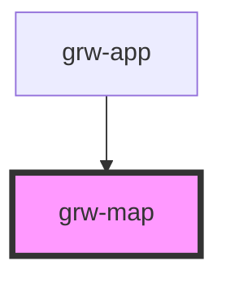

# grw-map

<!-- Auto Generated Below -->

## Properties

| Property                     | Attribute                       | Description | Type      | Default     |
| ---------------------------- | ------------------------------- | ----------- | --------- | ----------- |
| `attributionLayer`           | `attribution-layer`             |             | `string`  | `undefined` |
| `colorBackground`            | `color-background`              |             | `string`  | `'#fef7ff'` |
| `colorClusters`              | `color-clusters`                |             | `any`     | `null`      |
| `colorMarkers`               | `color-markers`                 |             | `any`     | `null`      |
| `colorOnPrimaryContainer`    | `color-on-primary-container`    |             | `string`  | `'#21005e'` |
| `colorOnSurface`             | `color-on-surface`              |             | `string`  | `'#49454e'` |
| `colorOutdoorArea`           | `color-outdoor-area`            |             | `string`  | `'#ffb700'` |
| `colorPrimaryApp`            | `color-primary-app`             |             | `string`  | `'#6b0030'` |
| `colorPrimaryContainer`      | `color-primary-container`       |             | `string`  | `'#eaddff'` |
| `colorSensitiveArea`         | `color-sensitive-area`          |             | `string`  | `'#4974a5'` |
| `colorTrekLine`              | `color-trek-line`               |             | `string`  | `'#6b0030'` |
| `commonMarkerSize`           | `common-marker-size`            |             | `number`  | `48`        |
| `departureArrivalMarkerSize` | `departure-arrival-marker-size` |             | `number`  | `14`        |
| `fontFamily`                 | `font-family`                   |             | `string`  | `'Roboto'`  |
| `grwApp`                     | `grw-app`                       |             | `boolean` | `false`     |
| `isLargeView`                | `is-large-view`                 |             | `boolean` | `false`     |
| `mainClusterSize`            | `main-cluster-size`             |             | `number`  | `48`        |
| `mainMarkerSize`             | `main-marker-size`              |             | `number`  | `32`        |
| `nameLayer`                  | `name-layer`                    |             | `string`  | `undefined` |
| `pointReferenceMarkerSize`   | `point-reference-marker-size`   |             | `number`  | `24`        |
| `selectedMainMarkerSize`     | `selected-main-marker-size`     |             | `number`  | `48`        |
| `tilesMaxZoomOffline`        | `tiles-max-zoom-offline`        |             | `number`  | `16`        |
| `urlLayer`                   | `url-layer`                     |             | `string`  | `undefined` |
| `useGradient`                | `use-gradient`                  |             | `boolean` | `false`     |

## Events

| Event                       | Description | Type                  |
| --------------------------- | ----------- | --------------------- |
| `outdoorCourseCardPress`    |             | `CustomEvent<number>` |
| `outdoorSiteCardPress`      |             | `CustomEvent<number>` |
| `touristicContentCardPress` |             | `CustomEvent<number>` |
| `touristicEventCardPress`   |             | `CustomEvent<number>` |
| `trekCardPress`             |             | `CustomEvent<number>` |

## Shadow Parts

| Part                     | Description |
| ------------------------ | ----------- |
| `"loader"`               |             |
| `"map"`                  |             |
| `"map-loader-container"` |             |

## Dependencies

### Used by

 - [grw-app](../grw-app)

### Graph

----------------------------------------------

*Built with [StencilJS](https://stenciljs.com/)*
