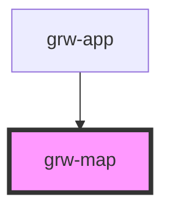

# grw-map

<!-- Auto Generated Below -->

## Properties

| Property                   | Attribute                     | Description | Type      | Default      |
| -------------------------- | ----------------------------- | ----------- | --------- | ------------ |
| `attribution`              | `attribution`                 |             | `string`  | `undefined`  |
| `center`                   | `center`                      |             | `string`  | `'1, 1'`     |
| `colorArrivalIcon`         | `color-arrival-icon`          |             | `string`  | `'#85003b'`  |
| `colorDepartureIcon`       | `color-departure-icon`        |             | `string`  | `'#006b3b'`  |
| `colorPoiIcon`             | `color-poi-icon`              |             | `string`  | `'#974c6e'`  |
| `colorPrimary`             | `color-primary`               |             | `string`  | `'#6b0030'`  |
| `colorPrimaryTint`         | `color-primary-tint`          |             | `string`  | `'#974c6e'`  |
| `colorSensitiveArea`       | `color-sensitive-area`        |             | `string`  | `'	#4974a5'` |
| `colorTrekLine`            | `color-trek-line`             |             | `string`  | `'#6b0030'`  |
| `resetStoreOnDisconnected` | `reset-store-on-disconnected` |             | `boolean` | `true`       |
| `urlLayer`                 | `url-layer`                   |             | `string`  | `undefined`  |
| `zoom`                     | `zoom`                        |             | `number`  | `10`         |

## Events

| Event           | Description | Type                  |
| --------------- | ----------- | --------------------- |
| `trekCardPress` |             | `CustomEvent<number>` |

## Dependencies

### Used by

 - [grw-app](../grw-app)

### Graph

----------------------------------------------

*Built with [StencilJS](https://stenciljs.com/)*
