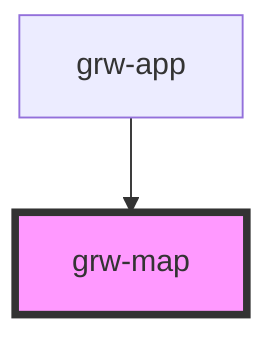

# grw-map

<!-- Auto Generated Below -->

## Properties

| Property                  | Attribute                     | Description | Type      | Default     |
| ------------------------- | ----------------------------- | ----------- | --------- | ----------- |
| `attributionLayer`        | `attribution-layer`           |             | `string`  | `undefined` |
| `colorBackground`         | `color-background`            |             | `string`  | `'#fef7ff'` |
| `colorOnPrimaryContainer` | `color-on-primary-container`  |             | `string`  | `'#21005e'` |
| `colorOnSurface`          | `color-on-surface`            |             | `string`  | `'#49454e'` |
| `colorOutdoorArea`        | `color-outdoor-area`          |             | `string`  | `'#ffb700'` |
| `colorPoiIcon`            | `color-poi-icon`              |             | `string`  | `'#974c6e'` |
| `colorPrimaryApp`         | `color-primary-app`           |             | `string`  | `'#6b0030'` |
| `colorPrimaryContainer`   | `color-primary-container`     |             | `string`  | `'#eaddff'` |
| `colorSensitiveArea`      | `color-sensitive-area`        |             | `string`  | `'#4974a5'` |
| `colorTrekLine`           | `color-trek-line`             |             | `string`  | `'#6b0030'` |
| `fontFamily`              | `font-family`                 |             | `string`  | `'Roboto'`  |
| `isLargeView`             | `is-large-view`               |             | `boolean` | `false`     |
| `nameLayer`               | `name-layer`                  |             | `string`  | `undefined` |
| `trekTilesMaxZoomOffline` | `trek-tiles-max-zoom-offline` |             | `number`  | `16`        |
| `urlLayer`                | `url-layer`                   |             | `string`  | `undefined` |
| `useGradient`             | `use-gradient`                |             | `boolean` | `false`     |

## Events

| Event                       | Description | Type                  |
| --------------------------- | ----------- | --------------------- |
| `outdoorCourseCardPress`    |             | `CustomEvent<number>` |
| `outdoorSiteCardPress`      |             | `CustomEvent<number>` |
| `touristicContentCardPress` |             | `CustomEvent<number>` |
| `touristicEventCardPress`   |             | `CustomEvent<number>` |
| `trekCardPress`             |             | `CustomEvent<number>` |

## Shadow Parts

| Part                     | Description |
| ------------------------ | ----------- |
| `"elevation"`            |             |
| `"loader"`               |             |
| `"map"`                  |             |
| `"map-bottom-space"`     |             |
| `"map-loader-container"` |             |

## Dependencies

### Used by

 - [grw-app](../grw-app)

### Graph

----------------------------------------------

*Built with [StencilJS](https://stenciljs.com/)*
