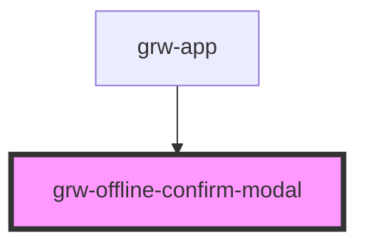

# grw-offline-confirm-modal

<!-- Auto Generated Below -->

## Properties

| Property | Attribute | Description | Type                                                               | Default     |
| -------- | --------- | ----------- | ------------------------------------------------------------------ | ----------- |
| `mode`   | `mode`    |             | `"outdoor" \| "touristicContents" \| "touristicEvents" \| "treks"` | `undefined` |

## Events

| Event           | Description | Type                  |
| --------------- | ----------- | --------------------- |
| `deletePress`   |             | `CustomEvent<number>` |
| `downloadPress` |             | `CustomEvent<number>` |

## Shadow Parts

| Part             | Description |
| ---------------- | ----------- |
| `"modal-button"` |             |

## Dependencies

### Used by

 - [grw-app](../grw-app)

### Graph

----------------------------------------------

*Built with [StencilJS](https://stenciljs.com/)*
