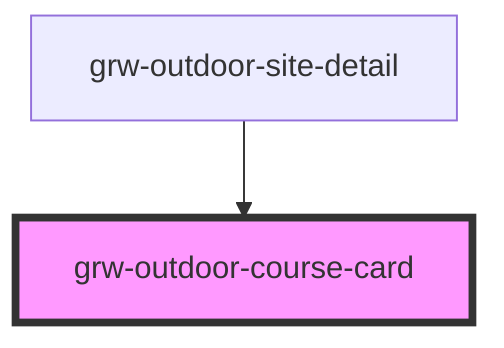

# grw-outdoor-course-card

<!-- Auto Generated Below -->

## Properties

| Property                    | Attribute                      | Description | Type                                                                                                                                                                                                                                                                                                                                                                                                                                                                                                                                                                                                                                      | Default     |
| --------------------------- | ------------------------------ | ----------- | ----------------------------------------------------------------------------------------------------------------------------------------------------------------------------------------------------------------------------------------------------------------------------------------------------------------------------------------------------------------------------------------------------------------------------------------------------------------------------------------------------------------------------------------------------------------------------------------------------------------------------------------- | ----------- |
| `colorOnSecondaryContainer` | `color-on-secondary-container` |             | `string`                                                                                                                                                                                                                                                                                                                                                                                                                                                                                                                                                                                                                                  | `'#1d192b'` |
| `colorOnSurface`            | `color-on-surface`             |             | `string`                                                                                                                                                                                                                                                                                                                                                                                                                                                                                                                                                                                                                                  | `'#49454e'` |
| `colorPrimaryApp`           | `color-primary-app`            |             | `string`                                                                                                                                                                                                                                                                                                                                                                                                                                                                                                                                                                                                                                  | `'#6b0030'` |
| `colorSecondaryContainer`   | `color-secondary-container`    |             | `string`                                                                                                                                                                                                                                                                                                                                                                                                                                                                                                                                                                                                                                  | `'#e8def8'` |
| `colorSurfaceContainerLow`  | `color-surface-container-low`  |             | `string`                                                                                                                                                                                                                                                                                                                                                                                                                                                                                                                                                                                                                                  | `'#f7f2fa'` |
| `fontFamily`                | `font-family`                  |             | `string`                                                                                                                                                                                                                                                                                                                                                                                                                                                                                                                                                                                                                                  | `'Roboto'`  |
| `isInsideHorizontalList`    | `is-inside-horizontal-list`    |             | `boolean`                                                                                                                                                                                                                                                                                                                                                                                                                                                                                                                                                                                                                                 | `false`     |
| `isLargeView`               | `is-large-view`                |             | `boolean`                                                                                                                                                                                                                                                                                                                                                                                                                                                                                                                                                                                                                                 | `false`     |
| `outdoorCourse`             | --                             |             | `{ id: number; name: string; geometry: GeometryCollection<Geometry>; accessibility: string; advice: string; attachments: Attachments; children: number[]; cities: string[]; description: string; districts: number[]; duration: number; equipment: string; gear: string; height: number; length: number; max_elevation: number; min_elevation: number; parents: number[]; pdf: string; points_reference: MultiPoint; provider: string; ratings: number[]; ratings_description: string; sites: number[]; structure: number; type: number; offline?: boolean; pois?: number[]; touristicContents?: number[]; touristicEvents?: number[]; }` | `undefined` |

## Events

| Event                         | Description | Type                  |
| ----------------------------- | ----------- | --------------------- |
| `cardOutdoorCourseMouseLeave` |             | `CustomEvent<any>`    |
| `cardOutdoorCourseMouseOver`  |             | `CustomEvent<number>` |
| `outdoorCourseCardPress`      |             | `CustomEvent<number>` |

## Shadow Parts

| Part                                     | Description |
| ---------------------------------------- | ----------- |
| `"more-details-button"`                  |             |
| `"outdoor-course-card"`                  |             |
| `"outdoor-course-img"`                   |             |
| `"outdoor-course-img-container"`         |             |
| `"outdoor-course-more-detail-container"` |             |
| `"outdoor-course-name"`                  |             |
| `"outdoor-course-practice-container"`    |             |
| `"outdoor-course-practice-name"`         |             |
| `"outdoor-course-sub-container"`         |             |
| `"outdoor-course-type-img"`              |             |

## Dependencies

### Used by

 - [grw-outdoor-site-detail](../grw-outdoor-site-detail)

### Graph

----------------------------------------------

*Built with [StencilJS](https://stenciljs.com/)*
