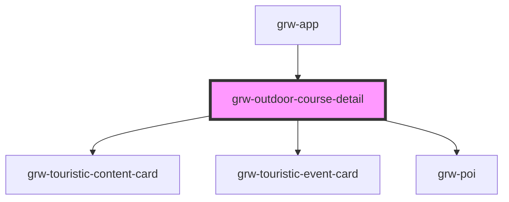

# grw-outdoor-course-detail

<!-- Auto Generated Below -->

## Properties

| Property                    | Attribute                      | Description | Type      | Default     |
| --------------------------- | ------------------------------ | ----------- | --------- | ----------- |
| `colorBackground`           | `color-background`             |             | `string`  | `'#fef7ff'` |
| `colorOnPrimaryContainer`   | `color-on-primary-container`   |             | `string`  | `'#21005e'` |
| `colorOnSecondaryContainer` | `color-on-secondary-container` |             | `string`  | `'#1d192b'` |
| `colorOnSurface`            | `color-on-surface`             |             | `string`  | `'#49454e'` |
| `colorPrimaryApp`           | `color-primary-app`            |             | `string`  | `'#6b0030'` |
| `colorPrimaryContainer`     | `color-primary-container`      |             | `string`  | `'#eaddff'` |
| `colorSecondaryContainer`   | `color-secondary-container`    |             | `string`  | `'#e8def8'` |
| `colorSurfaceContainerLow`  | `color-surface-container-low`  |             | `string`  | `'#f7f2fa'` |
| `fontFamily`                | `font-family`                  |             | `string`  | `'Roboto'`  |
| `isLargeView`               | `is-large-view`                |             | `boolean` | `false`     |
| `weather`                   | `weather`                      |             | `boolean` | `false`     |

## Events

| Event                           | Description | Type                   |
| ------------------------------- | ----------- | ---------------------- |
| `poiIsInViewport`               |             | `CustomEvent<boolean>` |
| `touristicContentsIsInViewport` |             | `CustomEvent<boolean>` |
| `touristicEventsIsInViewport`   |             | `CustomEvent<boolean>` |

## Shadow Parts

| Part                                       | Description |
| ------------------------------------------ | ----------- |
| `"advice"`                                 |             |
| `"advice-container"`                       |             |
| `"advice-title"`                           |             |
| `"cities"`                                 |             |
| `"cities-container"`                       |             |
| `"cities-title"`                           |             |
| `"current-advice-container"`               |             |
| `"departure"`                              |             |
| `"departure-container"`                    |             |
| `"departure-title"`                        |             |
| `"description"`                            |             |
| `"description-container"`                  |             |
| `"description-title"`                      |             |
| `"detail-bottom-space"`                    |             |
| `"divider"`                                |             |
| `"download-title"`                         |             |
| `"downloads-container"`                    |             |
| `"icon"`                                   |             |
| `"icon-label"`                             |             |
| `"icons-labels-container"`                 |             |
| `"label"`                                  |             |
| `"links-container"`                        |             |
| `"outdoor-course-close-fullcreen-icon"`    |             |
| `"outdoor-course-close-fullscreen-button"` |             |
| `"outdoor-course-detail-container"`        |             |
| `"outdoor-course-image-legend"`            |             |
| `"outdoor-course-images-container"`        |             |
| `"outdoor-course-img"`                     |             |
| `"outdoor-course-name"`                    |             |
| `"pois-container"`                         |             |
| `"pois-title"`                             |             |
| `"row"`                                    |             |
| `"sub-container"`                          |             |
| `"swiper-button-next"`                     |             |
| `"swiper-button-prev"`                     |             |
| `"swiper-images"`                          |             |
| `"swiper-pagination"`                      |             |
| `"swiper-pois"`                            |             |
| `"swiper-scrollbar"`                       |             |
| `"swiper-slide"`                           |             |
| `"swiper-touristic-content"`               |             |
| `"swiper-touristic-event"`                 |             |
| `"swiper-wrapper"`                         |             |
| `"touristic-content-container"`            |             |
| `"touristic-content-title"`                |             |
| `"touristic-event-container"`              |             |
| `"touristic-event-title"`                  |             |
| `"weather-container"`                      |             |

## Dependencies

### Used by

 - [grw-app](../grw-app)

### Depends on

- [grw-touristic-content-card](../grw-touristic-content-card)
- [grw-touristic-event-card](../grw-touristic-event-card)
- [grw-poi](../grw-poi-detail)

### Graph

----------------------------------------------

*Built with [StencilJS](https://stenciljs.com/)*
