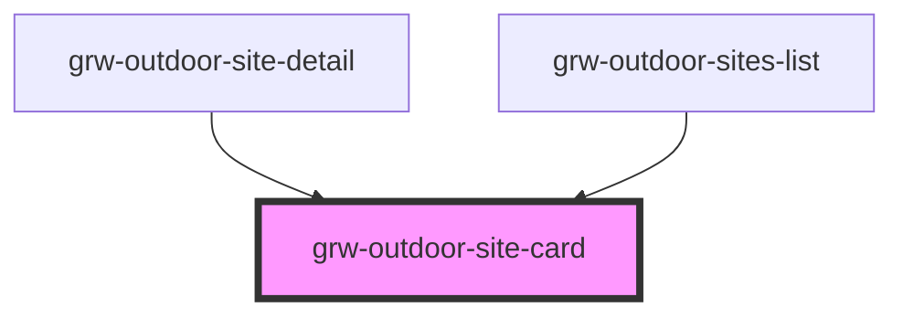

# grw-outdoor-site-card

<!-- Auto Generated Below -->

## Properties

| Property                    | Attribute                      | Description | Type                                                                                                                                                                                                                                                                                                                                                                                                                                                                                                                                                                                                                                                                                                                                                                   | Default     |
| --------------------------- | ------------------------------ | ----------- | ---------------------------------------------------------------------------------------------------------------------------------------------------------------------------------------------------------------------------------------------------------------------------------------------------------------------------------------------------------------------------------------------------------------------------------------------------------------------------------------------------------------------------------------------------------------------------------------------------------------------------------------------------------------------------------------------------------------------------------------------------------------------- | ----------- |
| `colorOnSecondaryContainer` | `color-on-secondary-container` |             | `string`                                                                                                                                                                                                                                                                                                                                                                                                                                                                                                                                                                                                                                                                                                                                                               | `'#1d192b'` |
| `colorOnSurface`            | `color-on-surface`             |             | `string`                                                                                                                                                                                                                                                                                                                                                                                                                                                                                                                                                                                                                                                                                                                                                               | `'#49454e'` |
| `colorPrimaryApp`           | `color-primary-app`            |             | `string`                                                                                                                                                                                                                                                                                                                                                                                                                                                                                                                                                                                                                                                                                                                                                               | `'#6b0030'` |
| `colorSecondaryContainer`   | `color-secondary-container`    |             | `string`                                                                                                                                                                                                                                                                                                                                                                                                                                                                                                                                                                                                                                                                                                                                                               | `'#e8def8'` |
| `colorSurfaceContainerLow`  | `color-surface-container-low`  |             | `string`                                                                                                                                                                                                                                                                                                                                                                                                                                                                                                                                                                                                                                                                                                                                                               | `'#f7f2fa'` |
| `fontFamily`                | `font-family`                  |             | `string`                                                                                                                                                                                                                                                                                                                                                                                                                                                                                                                                                                                                                                                                                                                                                               | `'Roboto'`  |
| `isInsideHorizontalList`    | `is-inside-horizontal-list`    |             | `boolean`                                                                                                                                                                                                                                                                                                                                                                                                                                                                                                                                                                                                                                                                                                                                                              | `false`     |
| `isLargeView`               | `is-large-view`                |             | `boolean`                                                                                                                                                                                                                                                                                                                                                                                                                                                                                                                                                                                                                                                                                                                                                              | `false`     |
| `outdoorSite`               | --                             |             | `{ id: number; name: string; geometry: GeometryCollection<Geometry>; accessibility: string; advice: string; ambiance: string; attachments: Attachments; cities: string[]; children: number[]; description: string; description_teaser: string; districts: number[]; labels: number[]; managers: number[]; orientation: string[]; pdf: string; period: string; parent: number; portal: number[]; practice: number; provider: string; ratings: number[]; sector: number; source: number[]; structure: number; themes: number[]; view_points: []; type: number; courses: number[]; web_links: Weblinks; wind: string[]; offline?: boolean; information_desks: number[]; pois?: number[]; touristicContents?: number[]; touristicEvents?: number[]; parents?: number[]; }` | `undefined` |

## Events

| Event                       | Description | Type                  |
| --------------------------- | ----------- | --------------------- |
| `cardOutdoorSiteMouseLeave` |             | `CustomEvent<any>`    |
| `cardOutdoorSiteMouseOver`  |             | `CustomEvent<number>` |
| `outdoorSiteCardPress`      |             | `CustomEvent<number>` |

## Shadow Parts

| Part                                   | Description |
| -------------------------------------- | ----------- |
| `"more-details-button"`                |             |
| `"outdoor-site-card"`                  |             |
| `"outdoor-site-img"`                   |             |
| `"outdoor-site-img-container"`         |             |
| `"outdoor-site-more-detail-container"` |             |
| `"outdoor-site-name"`                  |             |
| `"outdoor-site-practice-container"`    |             |
| `"outdoor-site-practice-name"`         |             |
| `"outdoor-site-sub-container"`         |             |
| `"outdoor-site-type-img"`              |             |
| `"theme"`                              |             |
| `"themes-container"`                   |             |

## Dependencies

### Used by

 - [grw-outdoor-site-detail](../grw-outdoor-site-detail)
 - [grw-outdoor-sites-list](../grw-outdoor-sites-list)

### Graph

----------------------------------------------

*Built with [StencilJS](https://stenciljs.com/)*
