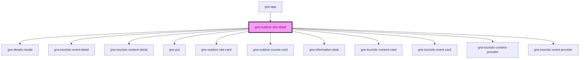

# grw-outdoor-site-detail

<!-- Auto Generated Below -->

## Properties

| Property                            | Attribute                              | Description | Type      | Default     |
| ----------------------------------- | -------------------------------------- | ----------- | --------- | ----------- |
| `colorBackground`                   | `color-background`                     |             | `string`  | `'#fef7ff'` |
| `colorOnPrimaryContainer`           | `color-on-primary-container`           |             | `string`  | `'#21005e'` |
| `colorOnSecondaryContainer`         | `color-on-secondary-container`         |             | `string`  | `'#1d192b'` |
| `colorOnSurface`                    | `color-on-surface`                     |             | `string`  | `'#49454e'` |
| `colorPrimaryApp`                   | `color-primary-app`                    |             | `string`  | `'#6b0030'` |
| `colorPrimaryContainer`             | `color-primary-container`              |             | `string`  | `'#eaddff'` |
| `colorSecondaryContainer`           | `color-secondary-container`            |             | `string`  | `'#e8def8'` |
| `colorSurfaceContainerLow`          | `color-surface-container-low`          |             | `string`  | `'#f7f2fa'` |
| `defaultBackgroundLayerAttribution` | `default-background-layer-attribution` |             | `any`     | `undefined` |
| `defaultBackgroundLayerUrl`         | `default-background-layer-url`         |             | `any`     | `undefined` |
| `enableOffline`                     | `enable-offline`                       |             | `boolean` | `false`     |
| `fontFamily`                        | `font-family`                          |             | `string`  | `'Roboto'`  |
| `globalTilesMaxZoomOffline`         | `global-tiles-max-zoom-offline`        |             | `number`  | `11`        |
| `globalTilesMinZoomOffline`         | `global-tiles-min-zoom-offline`        |             | `number`  | `0`         |
| `grwApp`                            | `grw-app`                              |             | `boolean` | `false`     |
| `isLargeView`                       | `is-large-view`                        |             | `boolean` | `false`     |
| `rounded`                           | `rounded`                              |             | `boolean` | `true`      |
| `tilesMaxZoomOffline`               | `tiles-max-zoom-offline`               |             | `number`  | `16`        |
| `tilesMinZoomOffline`               | `tiles-min-zoom-offline`               |             | `number`  | `12`        |
| `weather`                           | `weather`                              |             | `boolean` | `false`     |

## Events

| Event                           | Description | Type                   |
| ------------------------------- | ----------- | ---------------------- |
| `coursesIsInViewport`           |             | `CustomEvent<boolean>` |
| `deleteConfirm`                 |             | `CustomEvent<number>`  |
| `deleteErrorConfirm`            |             | `CustomEvent<number>`  |
| `deleteSuccessConfirm`          |             | `CustomEvent<number>`  |
| `downloadConfirm`               |             | `CustomEvent<number>`  |
| `downloadedErrorConfirm`        |             | `CustomEvent<number>`  |
| `downloadedSuccessConfirm`      |             | `CustomEvent<number>`  |
| `informationPlacesIsInViewport` |             | `CustomEvent<boolean>` |
| `poiIsInViewport`               |             | `CustomEvent<boolean>` |
| `sitesIsInViewport`             |             | `CustomEvent<boolean>` |
| `touristicContentsIsInViewport` |             | `CustomEvent<boolean>` |
| `touristicEventsIsInViewport`   |             | `CustomEvent<boolean>` |

## Shadow Parts

| Part                                     | Description |
| ---------------------------------------- | ----------- |
| `"accessibilites-title"`                 |             |
| `"accessibilities"`                      |             |
| `"accessibilities-container"`            |             |
| `"advice"`                               |             |
| `"advice-container"`                     |             |
| `"advice-title"`                         |             |
| `"ambiance"`                             |             |
| `"cities"`                               |             |
| `"cities-container"`                     |             |
| `"cities-title"`                         |             |
| `"current-advice-container"`             |             |
| `"departure"`                            |             |
| `"departure-container"`                  |             |
| `"departure-title"`                      |             |
| `"description"`                          |             |
| `"description-container"`                |             |
| `"description-teaser"`                   |             |
| `"description-title"`                    |             |
| `"detail-bottom-space"`                  |             |
| `"divider"`                              |             |
| `"download-title"`                       |             |
| `"downloads-container"`                  |             |
| `"icon"`                                 |             |
| `"icon-label"`                           |             |
| `"icons-labels-container"`               |             |
| `"information-desks-container"`          |             |
| `"information-desks-title"`              |             |
| `"label"`                                |             |
| `"links-container"`                      |             |
| `"offline-button"`                       |             |
| `"outdoor-site-close-fullcreen-icon"`    |             |
| `"outdoor-site-close-fullscreen-button"` |             |
| `"outdoor-site-detail-container"`        |             |
| `"outdoor-site-image-legend"`            |             |
| `"outdoor-site-images-container"`        |             |
| `"outdoor-site-img"`                     |             |
| `"outdoor-site-name"`                    |             |
| `"pois-container"`                       |             |
| `"pois-title"`                           |             |
| `"related-outdoor-courses-container"`    |             |
| `"related-outdoor-courses-title"`        |             |
| `"related-outdoor-sites-container"`      |             |
| `"related-outdoor-sites-title"`          |             |
| `"row"`                                  |             |
| `"source-advice"`                        |             |
| `"source-container"`                     |             |
| `"source-name"`                          |             |
| `"source-sub-container"`                 |             |
| `"source-title"`                         |             |
| `"sub-container"`                        |             |
| `"swiper-button-next"`                   |             |
| `"swiper-button-prev"`                   |             |
| `"swiper-images"`                        |             |
| `"swiper-information-desks"`             |             |
| `"swiper-pagination"`                    |             |
| `"swiper-pois"`                          |             |
| `"swiper-related-outdoor-courses"`       |             |
| `"swiper-related-outdoor-sites"`         |             |
| `"swiper-scrollbar"`                     |             |
| `"swiper-slide"`                         |             |
| `"swiper-touristic-content"`             |             |
| `"swiper-touristic-event"`               |             |
| `"swiper-wrapper"`                       |             |
| `"theme"`                                |             |
| `"themes-container"`                     |             |
| `"touristic-content-container"`          |             |
| `"touristic-content-title"`              |             |
| `"touristic-event-container"`            |             |
| `"touristic-event-title"`                |             |
| `"weather-container"`                    |             |
| `"weblink-container"`                    |             |
| `"weblinks-container"`                   |             |
| `"weblinks-title"`                       |             |

## Dependencies

### Used by

 - [grw-app](../grw-app)

### Depends on

- [grw-details-modal](../grw-details-modal)
- [grw-touristic-event-detail](../grw-touristic-event-detail)
- [grw-touristic-content-detail](../grw-touristic-content-detail)
- [grw-poi](../grw-poi-detail)
- [grw-outdoor-site-card](../grw-outdoor-site-card)
- [grw-outdoor-course-card](../grw-outdoor-course-card)
- [grw-information-desk](../grw-information-desk)
- [grw-touristic-content-card](../grw-touristic-content-card)
- [grw-touristic-event-card](../grw-touristic-event-card)
- [grw-touristic-content-provider](../../store)
- [grw-touristic-event-provider](../../store)

### Graph

----------------------------------------------

*Built with [StencilJS](https://stenciljs.com/)*
