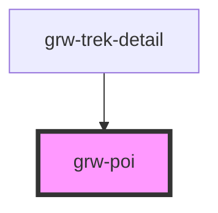

# grw-poi-detail

<!-- Auto Generated Below -->

## Properties

| Property | Attribute | Description | Type                                                                                                             | Default     |
| -------- | --------- | ----------- | ---------------------------------------------------------------------------------------------------------------- | ----------- |
| `poi`    | --        |             | `{ id: number; name: string; description: string; attachments: Attachments; type: number; geometry: Geometry; }` | `undefined` |

## Shadow Parts

| Part                       | Description |
| -------------------------- | ----------- |
| `"default-poi-img"`        |             |
| `"handle-poi-description"` |             |
| `"poi-description"`        |             |
| `"poi-img"`                |             |
| `"poi-name"`               |             |
| `"poi-sub-container"`      |             |
| `"poi-type"`               |             |
| `"poi-type-img-container"` |             |
| `"swiper-button-next"`     |             |
| `"swiper-button-prev"`     |             |
| `"swiper-pagination"`      |             |
| `"swiper-poi"`             |             |
| `"swiper-slide"`           |             |
| `"swiper-wrapper"`         |             |

## Dependencies

### Used by

 - [grw-trek-detail](../grw-trek-detail)

### Graph

----------------------------------------------

*Built with [StencilJS](https://stenciljs.com/)*
