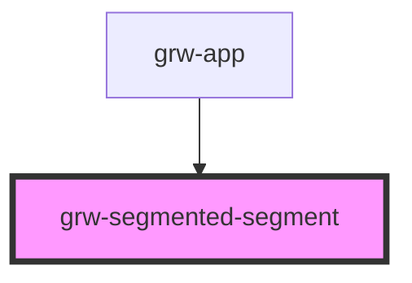

# grw-segmented-segment

<!-- Auto Generated Below -->

## Properties

| Property            | Attribute            | Description | Type      | Default    |
| ------------------- | -------------------- | ----------- | --------- | ---------- |
| `fontFamily`        | `font-family`        |             | `string`  | `'Roboto'` |
| `touristicContents` | `touristic-contents` |             | `boolean` | `false`    |
| `touristicEvents`   | `touristic-events`   |             | `boolean` | `false`    |
| `treks`             | `treks`              |             | `boolean` | `true`     |

## Shadow Parts

| Part                            | Description |
| ------------------------------- | ----------- |
| `"segment"`                     |             |
| `"segmented-buttons-container"` |             |

## Dependencies

### Used by

 - [grw-app](../grw-app)

### Graph

----------------------------------------------

*Built with [StencilJS](https://stenciljs.com/)*
