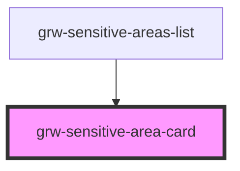

# grw-outdoor-site-card

<!-- Auto Generated Below -->

## Properties

| Property                    | Attribute                      | Description | Type                                                                                                                                                                                                                  | Default     |
| --------------------------- | ------------------------------ | ----------- | --------------------------------------------------------------------------------------------------------------------------------------------------------------------------------------------------------------------- | ----------- |
| `colorOnSecondaryContainer` | `color-on-secondary-container` |             | `string`                                                                                                                                                                                                              | `'#1d192b'` |
| `colorOnSurface`            | `color-on-surface`             |             | `string`                                                                                                                                                                                                              | `'#49454e'` |
| `colorPrimaryApp`           | `color-primary-app`            |             | `string`                                                                                                                                                                                                              | `'#6b0030'` |
| `colorSecondaryContainer`   | `color-secondary-container`    |             | `string`                                                                                                                                                                                                              | `'#e8def8'` |
| `colorSurfaceContainerLow`  | `color-surface-container-low`  |             | `string`                                                                                                                                                                                                              | `'#f7f2fa'` |
| `fontFamily`                | `font-family`                  |             | `string`                                                                                                                                                                                                              | `'Roboto'`  |
| `isInsideHorizontalList`    | `is-inside-horizontal-list`    |             | `boolean`                                                                                                                                                                                                             | `false`     |
| `isLargeView`               | `is-large-view`                |             | `boolean`                                                                                                                                                                                                             | `false`     |
| `sensitiveArea`             | --                             |             | `{ id: number; geometry: Geometry; name: string; description: string; species_id: number; contact: string; info_url: string; period: boolean[]; practices: number[]; offline?: boolean; attachments?: Attachments; }` | `undefined` |

## Events

| Event                         | Description | Type                  |
| ----------------------------- | ----------- | --------------------- |
| `cardSensitiveAreaMouseLeave` |             | `CustomEvent<any>`    |
| `cardSensitiveAreaMouseOver`  |             | `CustomEvent<number>` |
| `sensitiveAreaCardPress`      |             | `CustomEvent<number>` |

## Shadow Parts

| Part                                     | Description |
| ---------------------------------------- | ----------- |
| `"more-details-button"`                  |             |
| `"sensitive-area-card"`                  |             |
| `"sensitive-area-category"`              |             |
| `"sensitive-area-img"`                   |             |
| `"sensitive-area-img-container"`         |             |
| `"sensitive-area-more-detail-container"` |             |
| `"sensitive-area-name"`                  |             |
| `"sensitive-area-period-container"`      |             |
| `"sensitive-area-period-name"`           |             |
| `"sensitive-area-practice-container"`    |             |
| `"sensitive-area-practice-name"`         |             |
| `"sensitive-area-sub-container"`         |             |

## Dependencies

### Used by

 - [grw-sensitive-areas-list](../grw-sensitive-areas-list)

### Graph

----------------------------------------------

*Built with [StencilJS](https://stenciljs.com/)*
