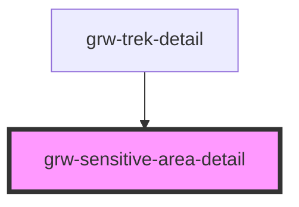

# grw-sensitive-area

<!-- Auto Generated Below -->

## Properties

| Property        | Attribute | Description | Type                                                                     | Default     |
| --------------- | --------- | ----------- | ------------------------------------------------------------------------ | ----------- |
| `sensitiveArea` | --        |             | `{ id: number; geometry: Geometry; name: string; description: string; }` | `undefined` |

## Dependencies

### Used by

 - [grw-trek-detail](../grw-trek-detail)

### Graph

----------------------------------------------

*Built with [StencilJS](https://stenciljs.com/)*
