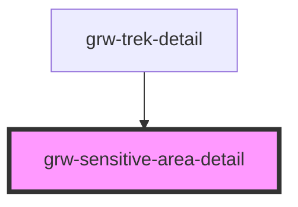

# grw-sensitive-area

<!-- Auto Generated Below -->

## Properties

| Property        | Attribute | Description | Type                                                                                                                                                | Default     |
| --------------- | --------- | ----------- | --------------------------------------------------------------------------------------------------------------------------------------------------- | ----------- |
| `sensitiveArea` | --        |             | `{ id: number; geometry: Geometry; name: string; description: string; contact: string; info_url: string; period: boolean[]; practices: number[]; }` | `undefined` |

## Shadow Parts

| Part                                  | Description |
| ------------------------------------- | ----------- |
| `"sensitive-area-color-container"`    |             |
| `"sensitive-area-contact-container"`  |             |
| `"sensitive-area-contact-title"`      |             |
| `"sensitive-area-contact-value"`      |             |
| `"sensitive-area-description"`        |             |
| `"sensitive-area-period"`             |             |
| `"sensitive-area-period-container"`   |             |
| `"sensitive-area-period-title"`       |             |
| `"sensitive-area-periods"`            |             |
| `"sensitive-area-practice"`           |             |
| `"sensitive-area-practice-container"` |             |
| `"sensitive-area-practice-title"`     |             |
| `"sensitive-area-practices"`          |             |
| `"sensitive-area-title"`              |             |
| `"sensitive-area-title-container"`    |             |

## Dependencies

### Used by

 - [grw-trek-detail](../grw-trek-detail)

### Graph

----------------------------------------------

*Built with [StencilJS](https://stenciljs.com/)*
