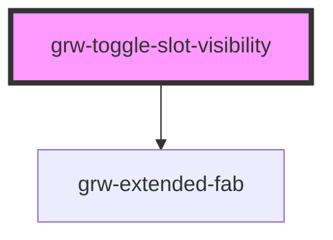

# grw-toggle-slot-visibility

<!-- Auto Generated Below -->

## Properties

| Property             | Attribute              | Description | Type     | Default     |
| -------------------- | ---------------------- | ----------- | -------- | ----------- |
| `fabBackgroundColor` | `fab-background-color` |             | `string` | `'#eaddff'` |
| `fabColor`           | `fab-color`            |             | `string` | `'#21005d'` |
| `fontFamily`         | `font-family`          |             | `string` | `'Roboto'`  |
| `largeViewSize`      | `large-view-size`      |             | `number` | `1024`      |
| `slotEndHeight`      | `slot-end-height`      |             | `string` | `'100vh'`   |

## Dependencies

### Depends on

- [grw-extended-fab](../grw-extended-fab)

### Graph

----------------------------------------------

*Built with [StencilJS](https://stenciljs.com/)*
