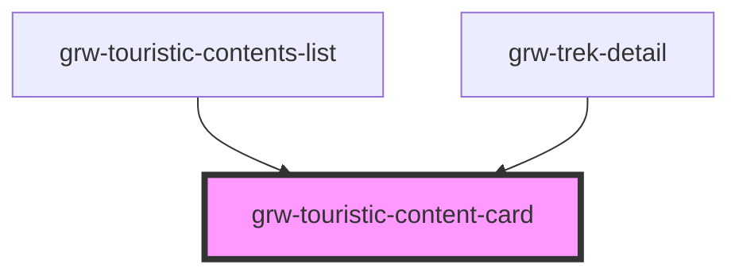

# grw-touristic-content-card

<!-- Auto Generated Below -->

## Properties

| Property                 | Attribute                   | Description | Type                                                                                                                                                                                                                                                                             | Default     |
| ------------------------ | --------------------------- | ----------- | -------------------------------------------------------------------------------------------------------------------------------------------------------------------------------------------------------------------------------------------------------------------------------- | ----------- |
| `isInsideHorizontalList` | `is-inside-horizontal-list` |             | `boolean`                                                                                                                                                                                                                                                                        | `false`     |
| `isLargeView`            | `is-large-view`             |             | `boolean`                                                                                                                                                                                                                                                                        | `false`     |
| `touristicContent`       | --                          |             | `{ id: number; name: string; attachments: Attachments; description?: string; description_teaser?: string; practical_info?: string; category: number; geometry: Point; cities?: string[]; source?: number[]; pdf?: string; contact?: string; email?: string; website?: string; }` | `undefined` |

## Events

| Event                            | Description | Type                  |
| -------------------------------- | ----------- | --------------------- |
| `cardTouristicContentMouseLeave` |             | `CustomEvent<any>`    |
| `cardTouristicContentMouseOver`  |             | `CustomEvent<number>` |
| `touristicContentCardPress`      |             | `CustomEvent<number>` |

## Dependencies

### Used by

 - [grw-touristic-contents-list](../grw-touristic-contents-list)
 - [grw-trek-detail](../grw-trek-detail)

### Graph

----------------------------------------------

*Built with [StencilJS](https://stenciljs.com/)*
