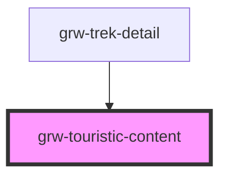

# grw-touristic-content

<!-- Auto Generated Below -->

## Properties

| Property           | Attribute | Description | Type                                                                                                                                                                                                                                                                             | Default     |
| ------------------ | --------- | ----------- | -------------------------------------------------------------------------------------------------------------------------------------------------------------------------------------------------------------------------------------------------------------------------------- | ----------- |
| `touristicContent` | --        |             | `{ id: number; name: string; attachments: Attachments; description?: string; description_teaser?: string; practical_info?: string; category: number; geometry: Point; cities?: string[]; source?: number[]; pdf?: string; contact?: string; email?: string; website?: string; }` | `undefined` |

## Events

| Event                       | Description | Type                  |
| --------------------------- | ----------- | --------------------- |
| `touristicContentCardPress` |             | `CustomEvent<number>` |

## Dependencies

### Used by

 - [grw-trek-detail](../grw-trek-detail)

### Graph

----------------------------------------------

*Built with [StencilJS](https://stenciljs.com/)*
