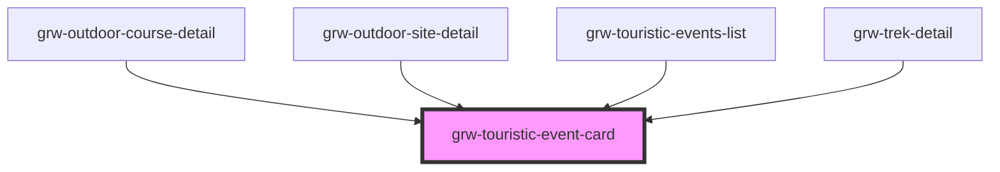

# grw-touristic-event-card

<!-- Auto Generated Below -->

## Properties

| Property                 | Attribute                   | Description | Type                                                                                                                                                                                                                                                                                                                                    | Default     |
| ------------------------ | --------------------------- | ----------- | --------------------------------------------------------------------------------------------------------------------------------------------------------------------------------------------------------------------------------------------------------------------------------------------------------------------------------------- | ----------- |
| `fontFamily`             | `font-family`               |             | `string`                                                                                                                                                                                                                                                                                                                                | `'Roboto'`  |
| `isInsideHorizontalList` | `is-inside-horizontal-list` |             | `boolean`                                                                                                                                                                                                                                                                                                                               | `false`     |
| `isLargeView`            | `is-large-view`             |             | `boolean`                                                                                                                                                                                                                                                                                                                               | `false`     |
| `touristicEvent`         | --                          |             | `{ id: number; name: string; attachments: Attachments; description?: string; description_teaser?: string; practical_info?: string; type: number; geometry: Point; cities?: string[]; source?: number[]; pdf?: string; contact?: string; email?: string; website?: string; begin_date?: string; end_date?: string; offline?: boolean; }` | `undefined` |

## Events

| Event                          | Description | Type                  |
| ------------------------------ | ----------- | --------------------- |
| `cardTouristicEventMouseLeave` |             | `CustomEvent<any>`    |
| `cardTouristicEventMouseOver`  |             | `CustomEvent<number>` |
| `touristicEventCardPress`      |             | `CustomEvent<number>` |

## Shadow Parts

| Part                                      | Description |
| ----------------------------------------- | ----------- |
| `"default-touristic-event-img"`           |             |
| `"more-details-button"`                   |             |
| `"swiper-button-next"`                    |             |
| `"swiper-button-prev"`                    |             |
| `"swiper-pagination"`                     |             |
| `"swiper-slide"`                          |             |
| `"swiper-touristic-event"`                |             |
| `"swiper-wrapper"`                        |             |
| `"touristic-event-card"`                  |             |
| `"touristic-event-date"`                  |             |
| `"touristic-event-date-container"`        |             |
| `"touristic-event-img"`                   |             |
| `"touristic-event-img-container"`         |             |
| `"touristic-event-more-detail-container"` |             |
| `"touristic-event-name"`                  |             |
| `"touristic-event-sub-container"`         |             |
| `"touristic-event-type-container"`        |             |
| `"touristic-event-type-img"`              |             |
| `"touristic-event-type-name"`             |             |

## Dependencies

### Used by

 - [grw-outdoor-course-detail](../grw-outdoor-course-detail)
 - [grw-outdoor-site-detail](../grw-outdoor-site-detail)
 - [grw-touristic-events-list](../grw-touristic-events-list)
 - [grw-trek-detail](../grw-trek-detail)

### Graph

----------------------------------------------

*Built with [StencilJS](https://stenciljs.com/)*
