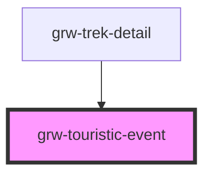

# grw-touristic-event

<!-- Auto Generated Below -->

## Properties

| Property         | Attribute | Description | Type                                                                    | Default     |
| ---------------- | --------- | ----------- | ----------------------------------------------------------------------- | ----------- |
| `touristicEvent` | --        |             | `{ id: number; name: string; attachments: Attachments; type: number; }` | `undefined` |

## Events

| Event                     | Description | Type                  |
| ------------------------- | ----------- | --------------------- |
| `touristicEventCardPress` |             | `CustomEvent<number>` |

## Dependencies

### Used by

 - [grw-trek-detail](../grw-trek-detail)

### Graph

----------------------------------------------

*Built with [StencilJS](https://stenciljs.com/)*
