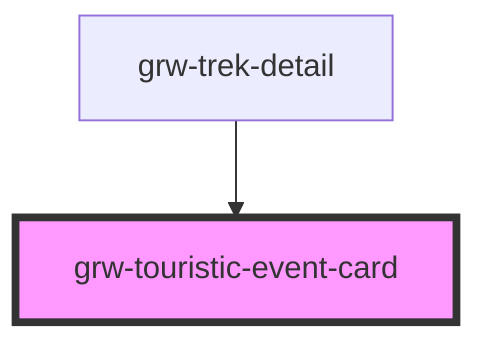

# grw-touristic-event-card

<!-- Auto Generated Below -->

## Properties

| Property         | Attribute | Description | Type                                                                                                                                                                                                                                                                         | Default     |
| ---------------- | --------- | ----------- | ---------------------------------------------------------------------------------------------------------------------------------------------------------------------------------------------------------------------------------------------------------------------------- | ----------- |
| `touristicEvent` | --        |             | `{ id: number; name: string; attachments: Attachments; description?: string; description_teaser?: string; practical_info?: string; type: number; geometry: Point; cities?: string[]; source?: number[]; pdf?: string; contact?: string; email?: string; website?: string; }` | `undefined` |

## Events

| Event                     | Description | Type                  |
| ------------------------- | ----------- | --------------------- |
| `touristicEventCardPress` |             | `CustomEvent<number>` |

## Dependencies

### Used by

 - [grw-trek-detail](../grw-trek-detail)

### Graph

----------------------------------------------

*Built with [StencilJS](https://stenciljs.com/)*
