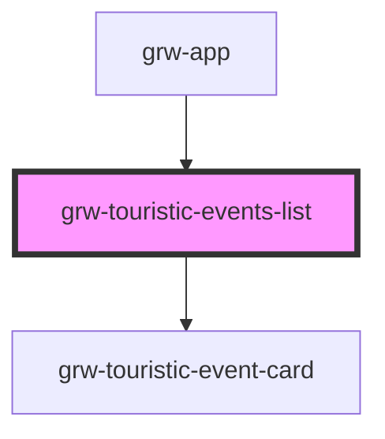

# grw-touristic-events-list

<!-- Auto Generated Below -->

## Properties

| Property                    | Attribute                      | Description | Type      | Default     |
| --------------------------- | ------------------------------ | ----------- | --------- | ----------- |
| `colorOnSecondaryContainer` | `color-on-secondary-container` |             | `string`  | `'#1d192b'` |
| `colorOnSurface`            | `color-on-surface`             |             | `string`  | `'#49454e'` |
| `colorPrimaryApp`           | `color-primary-app`            |             | `string`  | `'#6b0030'` |
| `colorSecondaryContainer`   | `color-secondary-container`    |             | `string`  | `'#e8def8'` |
| `colorSurfaceContainerLow`  | `color-surface-container-low`  |             | `string`  | `'#f7f2fa'` |
| `fontFamily`                | `font-family`                  |             | `string`  | `'Roboto'`  |
| `isLargeView`               | `is-large-view`                |             | `boolean` | `false`     |

## Shadow Parts

| Part                                              | Description |
| ------------------------------------------------- | ----------- |
| `"current-touristic-events-within-bounds-length"` |             |
| `"list-bottom-space"`                             |             |
| `"touristic-events-list-container"`               |             |

## Dependencies

### Used by

 - [grw-app](../grw-app)

### Depends on

- [grw-touristic-event-card](../grw-touristic-event-card)

### Graph

----------------------------------------------

*Built with [StencilJS](https://stenciljs.com/)*
