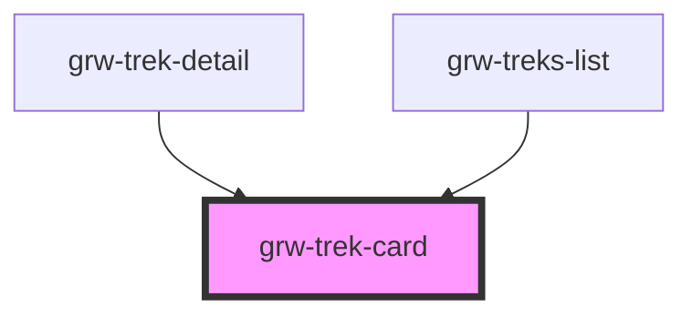

# grw-trek-card

<!-- Auto Generated Below -->

## Properties

| Property                    | Attribute                      | Description | Type                                                                                                                                                                                                                                                                                                                                                                                                                                                                                                                                                                                                                                                                                                                                                                                                                                                                                                                                                                                                                                                                                                                        | Default     |
| --------------------------- | ------------------------------ | ----------- | --------------------------------------------------------------------------------------------------------------------------------------------------------------------------------------------------------------------------------------------------------------------------------------------------------------------------------------------------------------------------------------------------------------------------------------------------------------------------------------------------------------------------------------------------------------------------------------------------------------------------------------------------------------------------------------------------------------------------------------------------------------------------------------------------------------------------------------------------------------------------------------------------------------------------------------------------------------------------------------------------------------------------------------------------------------------------------------------------------------------------- | ----------- |
| `colorOnSecondaryContainer` | `color-on-secondary-container` |             | `string`                                                                                                                                                                                                                                                                                                                                                                                                                                                                                                                                                                                                                                                                                                                                                                                                                                                                                                                                                                                                                                                                                                                    | `'#1d192b'` |
| `colorOnSurface`            | `color-on-surface`             |             | `string`                                                                                                                                                                                                                                                                                                                                                                                                                                                                                                                                                                                                                                                                                                                                                                                                                                                                                                                                                                                                                                                                                                                    | `'#49454e'` |
| `colorPrimaryApp`           | `color-primary-app`            |             | `string`                                                                                                                                                                                                                                                                                                                                                                                                                                                                                                                                                                                                                                                                                                                                                                                                                                                                                                                                                                                                                                                                                                                    | `'#6b0030'` |
| `colorSecondaryContainer`   | `color-secondary-container`    |             | `string`                                                                                                                                                                                                                                                                                                                                                                                                                                                                                                                                                                                                                                                                                                                                                                                                                                                                                                                                                                                                                                                                                                                    | `'#e8def8'` |
| `colorSurfaceContainerLow`  | `color-surface-container-low`  |             | `string`                                                                                                                                                                                                                                                                                                                                                                                                                                                                                                                                                                                                                                                                                                                                                                                                                                                                                                                                                                                                                                                                                                                    | `'#f7f2fa'` |
| `fontFamily`                | `font-family`                  |             | `string`                                                                                                                                                                                                                                                                                                                                                                                                                                                                                                                                                                                                                                                                                                                                                                                                                                                                                                                                                                                                                                                                                                                    | `'Roboto'`  |
| `isLargeView`               | `is-large-view`                |             | `boolean`                                                                                                                                                                                                                                                                                                                                                                                                                                                                                                                                                                                                                                                                                                                                                                                                                                                                                                                                                                                                                                                                                                                   | `false`     |
| `isStep`                    | `is-step`                      |             | `boolean`                                                                                                                                                                                                                                                                                                                                                                                                                                                                                                                                                                                                                                                                                                                                                                                                                                                                                                                                                                                                                                                                                                                   | `undefined` |
| `resetStoreOnDisconnected`  | `reset-store-on-disconnected`  |             | `boolean`                                                                                                                                                                                                                                                                                                                                                                                                                                                                                                                                                                                                                                                                                                                                                                                                                                                                                                                                                                                                                                                                                                                   | `true`      |
| `trek`                      | --                             |             | `{ id: number; name: string; attachments: Attachments; description?: string; description_teaser: string; difficulty: number; route: number; practice: number; themes: number[]; duration: number; length_2d: number; ascent: number; descent: number; departure: string; departure_city: string; arrival?: string; geometry?: LineString; departure_geom?: Position; gpx?: string; kml?: string; pdf?: string; parking_location?: Position; ambiance?: string; access?: string; public_transport?: string; advice?: string; advised_parking?: string; gear?: string; labels?: number[]; points_reference?: MultiPoint; source?: number[]; structure?: number; disabled_infrastructure?: string; accessibilities?: number[]; accessibility_level?: number; accessibility_slope?: string; accessibility_width?: string; accessibility_signage?: string; accessibility_covering?: string; accessibility_exposure?: string; accessibility_advice?: string; cities?: string[]; information_desks?: number[]; children?: number[]; ratings?: number[]; ratings_description?: string; networks: number[]; web_links: Weblink[]; }` | `undefined` |

## Events

| Event                | Description | Type                  |
| -------------------- | ----------- | --------------------- |
| `cardTrekMouseLeave` |             | `CustomEvent<any>`    |
| `cardTrekMouseOver`  |             | `CustomEvent<number>` |
| `trekCardPress`      |             | `CustomEvent<number>` |

## Dependencies

### Used by

 - [grw-trek-detail](../grw-trek-detail)
 - [grw-treks-list](../grw-treks-list)

### Graph

----------------------------------------------

*Built with [StencilJS](https://stenciljs.com/)*
