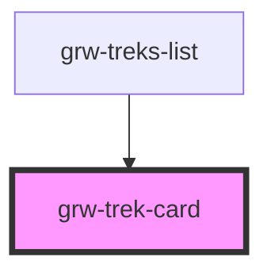

# grw-trek-card

<!-- Auto Generated Below -->

## Properties

| Property           | Attribute            | Description | Type                                                                                                                                                                                                                                                                                                                                                                                                                                                                                                                                                                                                                                                 | Default     |
| ------------------ | -------------------- | ----------- | ---------------------------------------------------------------------------------------------------------------------------------------------------------------------------------------------------------------------------------------------------------------------------------------------------------------------------------------------------------------------------------------------------------------------------------------------------------------------------------------------------------------------------------------------------------------------------------------------------------------------------------------------------- | ----------- |
| `colorPrimary`     | `color-primary`      |             | `string`                                                                                                                                                                                                                                                                                                                                                                                                                                                                                                                                                                                                                                             | `'#6b0030'` |
| `colorPrimaryTint` | `color-primary-tint` |             | `string`                                                                                                                                                                                                                                                                                                                                                                                                                                                                                                                                                                                                                                             | `'#974c6e'` |
| `isLargeView`      | `is-large-view`      |             | `boolean`                                                                                                                                                                                                                                                                                                                                                                                                                                                                                                                                                                                                                                            | `false`     |
| `trek`             | --                   |             | `{ id: number; name: string; attachments: Attachments; description?: string; description_teaser: string; difficulty: number; route: number; practice: number; themes: number[]; duration: number; length_2d: number; ascent: number; departure: string; arrival?: string; altimetric_profile?: string; geometry?: LineString; departure_geom?: Position; gpx?: string; kml?: string; pdf?: string; parking_location?: Position; ambiance?: string; access?: string; public_transport?: string; advice?: string; advised_parking?: string; gear?: string; labels?: number[]; points_reference?: MultiPoint; source?: number[]; structure?: number; }` | `undefined` |

## Events

| Event           | Description | Type                  |
| --------------- | ----------- | --------------------- |
| `trekCardPress` |             | `CustomEvent<number>` |

## Dependencies

### Used by

 - [grw-treks-list](../grw-treks-list)

### Graph

----------------------------------------------

*Built with [StencilJS](https://stenciljs.com/)*
