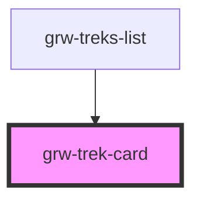

# grw-trek-card

<!-- Auto Generated Below -->

## Properties

| Property | Attribute | Description | Type                                                                                                                                                                                                                                                                        | Default     |
| -------- | --------- | ----------- | --------------------------------------------------------------------------------------------------------------------------------------------------------------------------------------------------------------------------------------------------------------------------- | ----------- |
| `trek`   | --        |             | `{ id: number; name: string; attachments: Attachments; description?: string; description_teaser: string; difficulty: number; route: number; practice: number; duration: number; length_2d: number; ascent: number; geometry: { type: string; coordinates: number[][]; }; }` | `undefined` |

## Events

| Event           | Description | Type                  |
| --------------- | ----------- | --------------------- |
| `trekCardPress` |             | `CustomEvent<number>` |

## Dependencies

### Used by

 - [grw-treks-list](../grw-treks-list)

### Graph

----------------------------------------------

*Built with [StencilJS](https://stenciljs.com/)*
