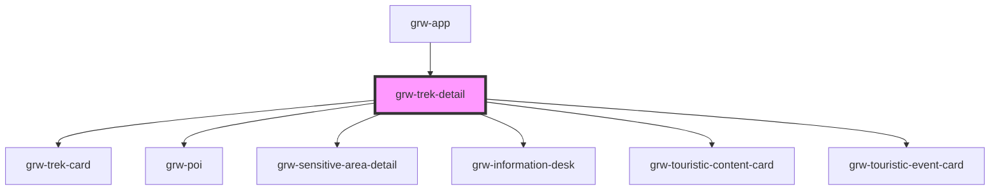

# grw-trek-detail

<!-- Auto Generated Below -->

## Properties

| Property                            | Attribute                              | Description | Type      | Default     |
| ----------------------------------- | -------------------------------------- | ----------- | --------- | ----------- |
| `colorBackground`                   | `color-background`                     |             | `string`  | `'#fef7ff'` |
| `colorOnPrimaryContainer`           | `color-on-primary-container`           |             | `string`  | `'#21005e'` |
| `colorOnSecondaryContainer`         | `color-on-secondary-container`         |             | `string`  | `'#1d192b'` |
| `colorOnSurface`                    | `color-on-surface`                     |             | `string`  | `'#49454e'` |
| `colorPrimaryApp`                   | `color-primary-app`                    |             | `string`  | `'#6b0030'` |
| `colorPrimaryContainer`             | `color-primary-container`              |             | `string`  | `'#eaddff'` |
| `colorSecondaryContainer`           | `color-secondary-container`            |             | `string`  | `'#e8def8'` |
| `colorSurfaceContainerLow`          | `color-surface-container-low`          |             | `string`  | `'#f7f2fa'` |
| `defaultBackgroundLayerAttribution` | `default-background-layer-attribution` |             | `any`     | `undefined` |
| `defaultBackgroundLayerUrl`         | `default-background-layer-url`         |             | `any`     | `undefined` |
| `emergencyNumber`                   | `emergency-number`                     |             | `number`  | `undefined` |
| `enableOffline`                     | `enable-offline`                       |             | `boolean` | `false`     |
| `fontFamily`                        | `font-family`                          |             | `string`  | `'Roboto'`  |
| `globalTilesMaxZoomOffline`         | `global-tiles-max-zoom-offline`        |             | `number`  | `11`        |
| `globalTilesMinZoomOffline`         | `global-tiles-min-zoom-offline`        |             | `number`  | `0`         |
| `grwApp`                            | `grw-app`                              |             | `boolean` | `false`     |
| `isLargeView`                       | `is-large-view`                        |             | `boolean` | `false`     |
| `tilesMaxZoomOffline`               | `tiles-max-zoom-offline`               |             | `number`  | `16`        |
| `tilesMinZoomOffline`               | `tiles-min-zoom-offline`               |             | `number`  | `12`        |
| `weather`                           | `weather`                              |             | `boolean` | `false`     |

## Events

| Event                           | Description | Type                   |
| ------------------------------- | ----------- | ---------------------- |
| `deleteConfirm`                 |             | `CustomEvent<number>`  |
| `deleteSuccessConfirm`          |             | `CustomEvent<number>`  |
| `descriptionIsInViewport`       |             | `CustomEvent<boolean>` |
| `downloadConfirm`               |             | `CustomEvent<number>`  |
| `downloadedSuccessConfirm`      |             | `CustomEvent<number>`  |
| `informationPlacesIsInViewport` |             | `CustomEvent<boolean>` |
| `parentTrekPress`               |             | `CustomEvent<number>`  |
| `parkingIsInViewport`           |             | `CustomEvent<boolean>` |
| `poiIsInViewport`               |             | `CustomEvent<boolean>` |
| `sensitiveAreaIsInViewport`     |             | `CustomEvent<boolean>` |
| `stepsIsInViewport`             |             | `CustomEvent<boolean>` |
| `touristicContentsIsInViewport` |             | `CustomEvent<boolean>` |
| `touristicEventsIsInViewport`   |             | `CustomEvent<boolean>` |

## Shadow Parts

| Part                                         | Description |
| -------------------------------------------- | ----------- |
| `"access"`                                   |             |
| `"access-container"`                         |             |
| `"access-title"`                             |             |
| `"accessibilities-container"`                |             |
| `"accessibilities-content-container"`        |             |
| `"accessibilities-title"`                    |             |
| `"accessibility-advice"`                     |             |
| `"accessibility-advice-container"`           |             |
| `"accessibility-advice-title"`               |             |
| `"accessibility-content-container"`          |             |
| `"accessibility-covering"`                   |             |
| `"accessibility-covering-container"`         |             |
| `"accessibility-covering-title"`             |             |
| `"accessibility-emergency-number-container"` |             |
| `"accessibility-emergency-number-content"`   |             |
| `"accessibility-emergency-number-title"`     |             |
| `"accessibility-exposure"`                   |             |
| `"accessibility-exposure-container"`         |             |
| `"accessibility-exposure-title"`             |             |
| `"accessibility-level-container"`            |             |
| `"accessibility-level-name"`                 |             |
| `"accessibility-level-title"`                |             |
| `"accessibility-name"`                       |             |
| `"accessibility-signage"`                    |             |
| `"accessibility-signage-container"`          |             |
| `"accessibility-signage-title"`              |             |
| `"accessibility-slope"`                      |             |
| `"accessibility-slope-container"`            |             |
| `"accessibility-slope-title"`                |             |
| `"accessibility-width"`                      |             |
| `"accessibility-width-container"`            |             |
| `"accessibility-width-title"`                |             |
| `"advice"`                                   |             |
| `"advice-container"`                         |             |
| `"advice-title"`                             |             |
| `"advised-parking"`                          |             |
| `"advised-parking-title"`                    |             |
| `"ambiance"`                                 |             |
| `"arrival"`                                  |             |
| `"arrival-container"`                        |             |
| `"arrival-title"`                            |             |
| `"cities"`                                   |             |
| `"cities-container"`                         |             |
| `"cities-title"`                             |             |
| `"current-advice-container"`                 |             |
| `"departure"`                                |             |
| `"departure-container"`                      |             |
| `"departure-title"`                          |             |
| `"description"`                              |             |
| `"description-container"`                    |             |
| `"description-teaser"`                       |             |
| `"description-title"`                        |             |
| `"detail-bottom-space"`                      |             |
| `"disabled-infrastructure"`                  |             |
| `"divider"`                                  |             |
| `"download-title"`                           |             |
| `"downloads-container"`                      |             |
| `"emergency-number"`                         |             |
| `"ensitive-areas-title"`                     |             |
| `"gear"`                                     |             |
| `"gear-container"`                           |             |
| `"icon"`                                     |             |
| `"icon-label"`                               |             |
| `"icons-labels-container"`                   |             |
| `"information-desks-container"`              |             |
| `"information-desks-title"`                  |             |
| `"label"`                                    |             |
| `"label-advice"`                             |             |
| `"label-container"`                          |             |
| `"label-name"`                               |             |
| `"label-sub-container"`                      |             |
| `"links-container"`                          |             |
| `"network"`                                  |             |
| `"offline-button"`                           |             |
| `"parent-trek-container"`                    |             |
| `"parent-trek-title"`                        |             |
| `"pois-container"`                           |             |
| `"pois-title"`                               |             |
| `"public-transport"`                         |             |
| `"public-transport-container"`               |             |
| `"public-transport-title"`                   |             |
| `"row"`                                      |             |
| `"sensitive-areas-container"`                |             |
| `"sensitive-areas-description"`              |             |
| `"source-advice"`                            |             |
| `"source-container"`                         |             |
| `"source-name"`                              |             |
| `"source-sub-container"`                     |             |
| `"source-title"`                             |             |
| `"step-container"`                           |             |
| `"step-title"`                               |             |
| `"sub-container"`                            |             |
| `"swiper-button-next"`                       |             |
| `"swiper-button-prev"`                       |             |
| `"swiper-images"`                            |             |
| `"swiper-information-desks"`                 |             |
| `"swiper-pagination"`                        |             |
| `"swiper-pois"`                              |             |
| `"swiper-scrollbar"`                         |             |
| `"swiper-slide"`                             |             |
| `"swiper-step"`                              |             |
| `"swiper-touristic-content"`                 |             |
| `"swiper-touristic-event"`                   |             |
| `"swiper-wrapper"`                           |             |
| `"theme"`                                    |             |
| `"themes-container"`                         |             |
| `"touristic-content-container"`              |             |
| `"touristic-content-title"`                  |             |
| `"touristic-event-container"`                |             |
| `"touristic-event-title"`                    |             |
| `"trek-close-fullcreen-icon"`                |             |
| `"trek-close-fullscreen-button"`             |             |
| `"trek-detail-container"`                    |             |
| `"trek-image-legend"`                        |             |
| `"trek-images"`                              |             |
| `"trek-img"`                                 |             |
| `"trek-indicator-selected-trek-option"`      |             |
| `"trek-name"`                                |             |
| `"trek-option"`                              |             |
| `"trek-options"`                             |             |
| `"weather-container"`                        |             |
| `"weblink-container"`                        |             |
| `"weblinks-container"`                       |             |
| `"weblinks-title"`                           |             |

## Dependencies

### Used by

 - [grw-app](../grw-app)

### Depends on

- [grw-trek-card](../grw-trek-card)
- [grw-poi](../grw-poi-detail)
- [grw-sensitive-area-detail](../grw-sensitive-area-detail)
- [grw-information-desk](../grw-information-desk)
- [grw-touristic-content-card](../grw-touristic-content-card)
- [grw-touristic-event-card](../grw-touristic-event-card)

### Graph

----------------------------------------------

*Built with [StencilJS](https://stenciljs.com/)*
