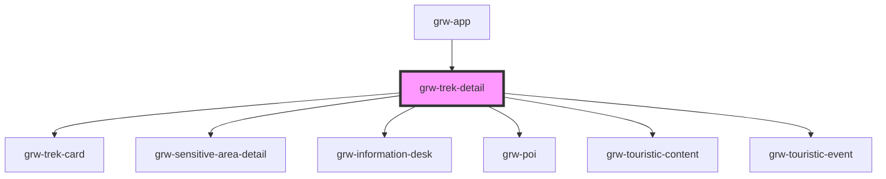

# grw-trek-detail

<!-- Auto Generated Below -->

## Properties

| Property                    | Attribute                      | Description | Type                                                                                                                                                                                                                                                                                                                                                                                                                                                                                                                                                                                                                                                                                                                                                                                                                                                                                                                                                                                                           | Default     |
| --------------------------- | ------------------------------ | ----------- | -------------------------------------------------------------------------------------------------------------------------------------------------------------------------------------------------------------------------------------------------------------------------------------------------------------------------------------------------------------------------------------------------------------------------------------------------------------------------------------------------------------------------------------------------------------------------------------------------------------------------------------------------------------------------------------------------------------------------------------------------------------------------------------------------------------------------------------------------------------------------------------------------------------------------------------------------------------------------------------------------------------- | ----------- |
| `colorBackground`           | `color-background`             |             | `string`                                                                                                                                                                                                                                                                                                                                                                                                                                                                                                                                                                                                                                                                                                                                                                                                                                                                                                                                                                                                       | `'#fef7ff'` |
| `colorOnPrimaryContainer`   | `color-on-primary-container`   |             | `string`                                                                                                                                                                                                                                                                                                                                                                                                                                                                                                                                                                                                                                                                                                                                                                                                                                                                                                                                                                                                       | `'#21005e'` |
| `colorOnSecondaryContainer` | `color-on-secondary-container` |             | `string`                                                                                                                                                                                                                                                                                                                                                                                                                                                                                                                                                                                                                                                                                                                                                                                                                                                                                                                                                                                                       | `'#1d192b'` |
| `colorOnSurface`            | `color-on-surface`             |             | `string`                                                                                                                                                                                                                                                                                                                                                                                                                                                                                                                                                                                                                                                                                                                                                                                                                                                                                                                                                                                                       | `'#49454e'` |
| `colorPrimaryApp`           | `color-primary-app`            |             | `string`                                                                                                                                                                                                                                                                                                                                                                                                                                                                                                                                                                                                                                                                                                                                                                                                                                                                                                                                                                                                       | `'#6b0030'` |
| `colorPrimaryContainer`     | `color-primary-container`      |             | `string`                                                                                                                                                                                                                                                                                                                                                                                                                                                                                                                                                                                                                                                                                                                                                                                                                                                                                                                                                                                                       | `'#eaddff'` |
| `colorSecondaryContainer`   | `color-secondary-container`    |             | `string`                                                                                                                                                                                                                                                                                                                                                                                                                                                                                                                                                                                                                                                                                                                                                                                                                                                                                                                                                                                                       | `'#e8def8'` |
| `colorSurfaceContainerLow`  | `color-surface-container-low`  |             | `string`                                                                                                                                                                                                                                                                                                                                                                                                                                                                                                                                                                                                                                                                                                                                                                                                                                                                                                                                                                                                       | `'#f7f2fa'` |
| `isLargeView`               | `is-large-view`                |             | `boolean`                                                                                                                                                                                                                                                                                                                                                                                                                                                                                                                                                                                                                                                                                                                                                                                                                                                                                                                                                                                                      | `false`     |
| `resetStoreOnDisconnected`  | `reset-store-on-disconnected`  |             | `boolean`                                                                                                                                                                                                                                                                                                                                                                                                                                                                                                                                                                                                                                                                                                                                                                                                                                                                                                                                                                                                      | `true`      |
| `trek`                      | --                             |             | `{ id: number; name: string; attachments: Attachments; description?: string; description_teaser: string; difficulty: number; route: number; practice: number; themes: number[]; duration: number; length_2d: number; ascent: number; departure: string; departure_city: string; arrival?: string; geometry?: LineString; departure_geom?: Position; gpx?: string; kml?: string; pdf?: string; parking_location?: Position; ambiance?: string; access?: string; public_transport?: string; advice?: string; advised_parking?: string; gear?: string; labels?: number[]; points_reference?: MultiPoint; source?: number[]; structure?: number; disabled_infrastructure?: string; accessibilities?: number[]; accessibility_level?: number; accessibility_slope?: string; accessibility_width?: string; accessibility_signage?: string; accessibility_covering?: string; accessibility_exposure?: string; accessibility_advice?: string; cities?: string[]; information_desks?: number[]; children?: number[]; }` | `undefined` |
| `weather`                   | `weather`                      |             | `boolean`                                                                                                                                                                                                                                                                                                                                                                                                                                                                                                                                                                                                                                                                                                                                                                                                                                                                                                                                                                                                      | `false`     |

## Events

| Event                           | Description | Type                   |
| ------------------------------- | ----------- | ---------------------- |
| `descriptionIsInViewport`       |             | `CustomEvent<boolean>` |
| `informationDeskIsInViewport`   |             | `CustomEvent<boolean>` |
| `parentTrekPress`               |             | `CustomEvent<number>`  |
| `parkingIsInViewport`           |             | `CustomEvent<boolean>` |
| `poiIsInViewport`               |             | `CustomEvent<boolean>` |
| `sensitiveAreaIsInViewport`     |             | `CustomEvent<boolean>` |
| `stepsIsInViewport`             |             | `CustomEvent<boolean>` |
| `touristicContentsIsInViewport` |             | `CustomEvent<boolean>` |

## Dependencies

### Used by

 - [grw-app](../grw-app)

### Depends on

- [grw-trek-card](../grw-trek-card)
- [grw-sensitive-area-detail](../grw-sensitive-area-detail)
- [grw-information-desk](../grw-information-desk)
- [grw-poi](../grw-poi-detail)
- [grw-touristic-content](../grw-touristic-content)
- [grw-touristic-event](../grw-touristic-event)

### Graph

----------------------------------------------

*Built with [StencilJS](https://stenciljs.com/)*
