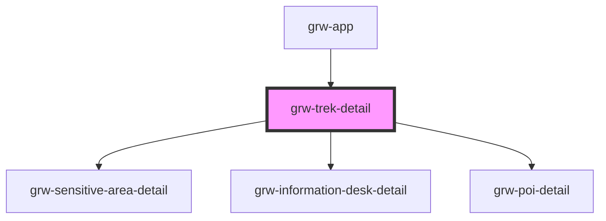

# grw-trek-detail

<!-- Auto Generated Below -->

## Properties

| Property            | Attribute             | Description | Type                                                                                                                                                                                                                                                                                                                                                                                | Default     |
| ------------------- | --------------------- | ----------- | ----------------------------------------------------------------------------------------------------------------------------------------------------------------------------------------------------------------------------------------------------------------------------------------------------------------------------------------------------------------------------------- | ----------- |
| `colorPrimary`      | `color-primary`       |             | `string`                                                                                                                                                                                                                                                                                                                                                                            | `'#6b0030'` |
| `colorPrimaryShade` | `color-primary-shade` |             | `string`                                                                                                                                                                                                                                                                                                                                                                            | `'#4a0021'` |
| `colorPrimaryTint`  | `color-primary-tint`  |             | `string`                                                                                                                                                                                                                                                                                                                                                                            | `'#974c6e'` |
| `trek`              | --                    |             | `{ id: number; name: string; attachments: Attachments; description?: string; description_teaser: string; difficulty: number; route: number; practice: number; themes: number[]; duration: number; length_2d: number; ascent: number; departure: string; geometry?: LineString; departure_geom?: Position; gpx?: string; kml?: string; pdf?: string; parking_location?: Position; }` | `undefined` |

## Dependencies

### Used by

 - [grw-app](../grw-app)

### Depends on

- [grw-sensitive-area-detail](../grw-sensitive-area-detail)
- [grw-information-desk-detail](../grw-information-desk-detail)
- [grw-poi-detail](../grw-poi-detail)

### Graph

----------------------------------------------

*Built with [StencilJS](https://stenciljs.com/)*
