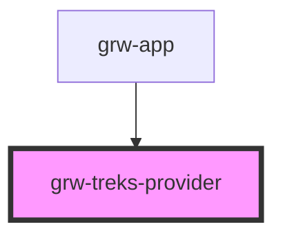

# grw-treks-provider

<!-- Auto Generated Below -->

## Properties

| Property     | Attribute    | Description | Type     | Default     |
| ------------ | ------------ | ----------- | -------- | ----------- |
| `api`        | `api`        |             | `string` | `undefined` |
| `cities`     | `cities`     |             | `string` | `undefined` |
| `districts`  | `districts`  |             | `string` | `undefined` |
| `inBbox`     | `in-bbox`    |             | `string` | `undefined` |
| `language`   | `language`   |             | `string` | `'fr'`      |
| `portals`    | `portals`    |             | `string` | `undefined` |
| `practices`  | `practices`  |             | `string` | `undefined` |
| `routes`     | `routes`     |             | `string` | `undefined` |
| `structures` | `structures` |             | `string` | `undefined` |
| `themes`     | `themes`     |             | `string` | `undefined` |

## Dependencies

### Used by

 - [grw-app](../components/grw-app)

### Graph

----------------------------------------------

*Built with [StencilJS](https://stenciljs.com/)*
