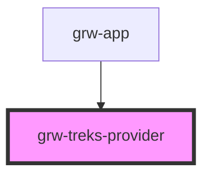

# grw-treks-provider

<!-- Auto Generated Below -->

## Properties

| Property  | Attribute | Description | Type     | Default     |
| --------- | --------- | ----------- | -------- | ----------- |
| `api`     | `api`     |             | `string` | `undefined` |
| `portals` | `portals` |             | `string` | `undefined` |

## Dependencies

### Used by

 - [grw-app](../components/grw-app)

### Graph

----------------------------------------------

*Built with [StencilJS](https://stenciljs.com/)*
